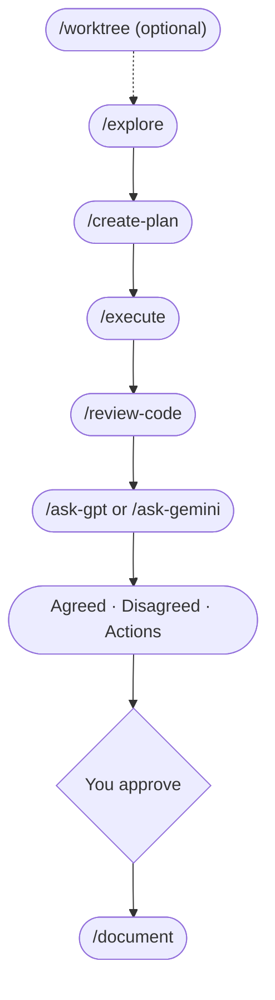

# LLM Peer Review

**A full project workflow where AI models debate your work before you ship it.**

Whether you're speccing a feature, conducting competitive research, building a plan, or writing code, this toolkit gives you a structured process: explore the problem, create a plan, build, review, then run a 3-round debate between Claude and ChatGPT (or Gemini). They push back on each other, concede points, and produce a structured verdict: what they agreed on, where they disagreed, and a prioritized action list. Then you approve what gets implemented.

This is the same consensus/divergence synthesis that [Perplexity's Model Council](https://www.perplexity.ai/hub/blog/introducing-model-council) produces and what [Karpathy's LLM Council](https://github.com/karpathy/llm-council) does for general Q&A, applied to a full project lifecycle with multi-round adversarial debate and an implementation workflow.

**Inspired by [Zevi Arnovitz's workflow on Lenny's Podcast](https://www.youtube.com/watch?v=1em64iUFt3U).** The key difference is that Zevi manually conducts peer reviews by copying feedback from one model to another because he likes seeing the reasoning from tools like ChatGPT or Gemini. This toolkit automates the entire process with two slash commands - `/ask-gpt` and `/ask-gemini` - that handle the multi-round debate loop for you.

Works for product specs, research plans, competitive analysis, and code equally.



> If the diagram doesn't render, here's the flow: `/worktree` (optional) -> `/explore` -> `/create-plan` -> `/execute` -> `/review-code` -> `/ask-gpt` or `/ask-gemini` -> `/document`

---

## Commands

| Command | What it does |
|---|---|
| `/explore` | Think through the problem - scoping for concrete features, vision for strategy and ideation |
| `/create-plan` | Write a step-by-step plan with status tracking |
| `/execute` | Build it, updating the plan as you go |
| `/review-code` | Code review (single pass or 4 sub-agents) - reports issues only, won't fix until you say so |
| `/review-commands` | Review slash command prompts for quality, workflow, and consistency |
| `/review-plan` | Check if implementation matches a plan file in `.claude/plans/` |
| `/review-ux` | UX review from code/markup - usability, accessibility, user flows |
| `/review-full` | Pre-release cross-domain check with Ready / Not ready recommendation |
| `/peer-review` | Evaluate feedback from other AI models |
| `/document` | Update your README and docs to match what was built |
| `/create-issue` | Create a GitHub issue (asks you questions first) |
| `/pair-debug` | Focused debugging partner - investigate before fixing |
| `/ask-gpt` | Debate your work with ChatGPT (3 rounds) |
| `/ask-gemini` | Debate your work with Gemini (3 rounds) |
| `/package-review` | Bundle your work into one file for external review |
| `/learning-opportunity` | Learn a concept at 3 levels of depth |
| `/worktree` | Create an isolated parallel session in a new worktree |

> `/ask-gpt` and `/ask-gemini` automate the full debate loop. `/peer-review` is for when you paste feedback from an external tool manually.
>
> `/worktree` creates an isolated copy of your project so you can work on something else without interrupting your current work. See [Multi-Session Worktree Support](#multi-session-worktree-support).

#### Which review command do I use?

| I need to... | Use |
|---|---|
| Check code for bugs, security, and quality | `/review-code` |
| Review slash command prompts and workflows | `/review-commands` |
| Verify implementation matches a plan | `/review-plan` |
| Evaluate UX, accessibility, and user flows | `/review-ux` |
| Pre-release go/no-go check across all domains | `/review-full` |

### The Workflow

Use them in this order:

```
/worktree (optional)  →  /explore  →  /create-plan  →  /execute  →  /review-code  →  /ask-gpt or /ask-gemini  →  /document
```

You don't have to use every command every time. But following the order prevents the most common mistake: coding before you've thought it through.

> **Working on multiple things at once?** Use `/worktree` first to create an isolated copy, then open it in a new Cursor window and run `/explore` there.

---

## Requirements

This toolkit runs on **macOS, Linux, or WSL** (Windows Subsystem for Linux). Windows users: [install WSL](SETUP.md#step-4-optional-install-wsl-if-you-prefer-bash-workflow) first.

## Setting Up a Brand New Computer

> **Never set up a dev environment before?** Follow the step-by-step guide in **[SETUP.md](SETUP.md)**. It covers Windows (WSL), Mac, Node.js, GitHub CLI, Cursor, and API keys - everything you need from scratch.

If you already have Node.js, git, and Cursor installed, skip ahead to [Add to a New Project](#add-to-a-new-project).

> **Not using Cursor?** The setup guide assumes Cursor, but the toolkit works with any editor that supports Claude Code. Copy the relevant setup page into any AI assistant and ask it to rewrite the steps for your editor.

---

## Add to a New Project

This isn't an app you install - it's a set of instructions that live in your project folder. Once they're there, type `/` in your editor and the commands show up.

**First time?** Use the quick setup (one command, nothing to install).
**Setting up multiple projects?** Install a reusable command first, then use it anywhere.

### Quick Setup (One Command)

Pick the script that matches your shell:

**Bash (WSL, macOS, Linux):**
```bash
bash /path/to/llm-peer-review/scripts/setup/setup.sh /path/to/your-project
```

**PowerShell (for setup only - see [Requirements](#requirements)):**
```powershell
powershell -ExecutionPolicy Bypass -File C:\path\to\llm-peer-review\scripts\setup\setup.ps1 -Target "C:\path\to\your-project"
```

Or run from inside your project directory (no target needed):
```bash
cd /path/to/your-project
bash /path/to/llm-peer-review/scripts/setup/setup.sh
```

> **Note:** If you run the script from inside the toolkit repository without specifying a target, it will show an error to prevent accidentally copying files into the wrong place.

The scripts copy commands, runtime scripts (ask-gpt.js, ask-gemini.js), and toolkit rules to your project. Setup scripts stay in the toolkit repo and are not copied. CLAUDE.md, LESSONS.md, and settings.local.json are skipped if they already exist - those are yours to customize. Toolkit rules (`.claude/rules/toolkit.md`) are always updated. See [How It Works](#how-it-works-file-architecture) for details on which files are yours vs. managed by the toolkit.

### Reusable Command (For Multiple Projects)

Install a `setup-claude-toolkit` command you can run from anywhere:

**Bash (WSL, macOS, Linux):**
```bash
cd /path/to/llm-peer-review
bash scripts/setup/install-alias.sh
source ~/.bashrc  # or ~/.zshrc for zsh
```

**PowerShell (native Windows):**
```powershell
cd C:\path\to\llm-peer-review
powershell -ExecutionPolicy Bypass -File scripts\setup\install-alias.ps1
. $PROFILE  # Reload profile (or restart PowerShell)
```

> **Note:** If you don't have a PowerShell profile yet, the installer will create one for you automatically.

Then use it from anywhere:
```bash
setup-claude-toolkit /path/to/your-project
```

<details>
<summary><strong>Advanced: Manual Setup or AI Agent Setup</strong></summary>

#### Do It Manually

Copy these into your project:

| What to copy | Where it goes |
|---|---|
| `.claude/commands/` (whole folder) | `your-project/.claude/commands/` |
| `.claude/rules/toolkit.md` | `your-project/.claude/rules/toolkit.md` |
| `.claude/settings.local.json` | `your-project/.claude/settings.local.json` |
| `scripts/` (only `ask-gpt.js` and `ask-gemini.js`) | `your-project/scripts/` |
| `CLAUDE.md` | `your-project/CLAUDE.md` |
| `LESSONS.md` | `your-project/LESSONS.md` |
| `.env.local.example` | `your-project/.env.local.example` |
| `.gitignore` | `your-project/.gitignore` |
| `.gitattributes` | `your-project/.gitattributes` |

Then in your project folder:
```bash
npm install @google/generative-ai openai
cp .env.local.example .env.local
# Open .env.local and paste your API keys
```

> The `npm install` and `.env.local` steps are only needed if you want `/ask-gpt` or `/ask-gemini`. The other 13 commands work without them.

#### Let Your AI Agent Do It

Tell your AI agent (Claude Code, Cursor, etc.): "Set up the workflow from this repo in my project" and point it to [`AGENT-SETUP.md`](AGENT-SETUP.md). It has step-by-step instructions written for AI agents.

</details>

---

## Update an Existing Project

Re-run the same setup command. It's safe to rerun - commands, scripts, and toolkit rules get updated; your `CLAUDE.md`, `LESSONS.md`, and `settings.local.json` are never overwritten. Your `.gitignore` is merged (new toolkit entries are added, your custom entries are preserved).

**Coming from before the CLAUDE.md split?** If your `CLAUDE.md` has toolkit rules mixed in (workflow, permissions, slash commands table), those now live in `.claude/rules/toolkit.md`. After re-running setup, edit your `CLAUDE.md` to keep only project-specific info. See [CHANGELOG.md](CHANGELOG.md) for details.

### Checking Your Version

Open `.claude/rules/toolkit.md` in your project. The first comment at the top shows your installed version:

```
<!-- Toolkit version: X.Y.Z | Managed by LLM Peer Review. ...
```

To update, re-run setup. The version stamp updates automatically. See [CHANGELOG.md](CHANGELOG.md) for what changed between versions.

---

## How `/ask-gpt` and `/ask-gemini` Work

`/ask-gpt` and `/ask-gemini` run an automated debate between Claude and another AI about your code or plan. You don't have to copy anything manually - it handles the whole loop.

### Example

```
You: /ask-gpt

Claude: What would you like me to review?
        1. Plan    2. Code    3. Branch    4. Feature    5. Other

You: Review the auth middleware

Claude: [Gathers context → sends to ChatGPT → they debate 3 rounds]

        --- Summary ---
        Agreed: Add token expiry check, extract magic numbers

        Recommended Actions:
        - [ ] Add token expiry validation
        - [ ] Move 3600 to TOKEN_EXPIRY_SECONDS

        Want me to implement these?

You: Yes
```

Want a different perspective? Run `/ask-gemini` next.

> **API costs:** Each 3-round debate typically costs $0.01-$0.10 in API credits depending on context size. You'll need an OpenAI and/or Gemini API key with credits. See **[API-KEYS.md](API-KEYS.md)** for a step-by-step setup guide.

### What It Looks Like

**Choosing what to review:**


**The structured debate output:**


---

## How It Works: File Architecture

When you set up the toolkit in a project, it creates several files. Here's how they fit together:

| File | Who owns it | What it does |
|---|---|---|
| `CLAUDE.md` | **You** | Your project-specific instructions (tech stack, preferences, team info). Never overwritten by setup. |
| `.claude/rules/toolkit.md` | **Toolkit** | Workflow rules, slash command docs, permissions. Always updated when you re-run setup. |
| `.claude/commands/*.md` | **Toolkit** (editable) | One file per slash command. You can customize these. |
| `LESSONS.md` | **You** | Track what you learn across sessions. Never overwritten. |

Setup also copies a few supporting files (`.gitignore`, `.gitattributes`, `settings.local.json`, `.env.local.example`). See [Option C](#option-c-do-it-manually) for the full list.

**Why is CLAUDE.md empty?** On purpose. It's a blank slate for your project-specific info. The toolkit rules live in `.claude/rules/toolkit.md` instead, so toolkit updates can reach you without overwriting your project notes.

**How does Claude find toolkit.md?** Claude Code automatically reads every file in `.claude/rules/` when it opens your project. No config needed - just having the file there is enough.

---

## Multi-Session Worktree Support

If you run multiple Claude Code sessions at the same time (in Cursor windows or via Remote Control), use Git worktrees so sessions don't conflict with each other.

**Starting a parallel session:** Type `/worktree` in the Claude Code panel. It creates an isolated worktree, installs dependencies, and copies your API keys. Open the path it gives you in a new Cursor window.

**What the toolkit does automatically:**
- `/worktree` creates the worktree, installs `npm` dependencies, and copies `.env.local`
- `/explore` and `/create-plan` detect worktree sessions and rename the branch to `worktree-<issue-number>-<short-label>` when an issue is referenced
- `/document` creates a PR from the worktree branch and offers to clean up the worktree folder when you're done
- The branch and PR stay alive even after the worktree folder is deleted - you can always re-create a worktree if fixes are needed

**What `/worktree` does:**
1. Checks you're not already in a worktree (and warns about uncommitted changes)
2. Creates a new worktree in `.claude/worktrees/worktree-N`
3. Runs `npm install` if a `package.json` exists (so debate scripts work)
4. Copies `.env.local` so API keys are available
5. Prints the path to open in a new Cursor window

**Key concept:** A worktree is just a folder. Deleting the folder does not delete the branch or PR. Think of it like closing a document window vs. deleting the file.

---

## Customization

- **CLAUDE.md** - Your project-specific instructions. Describe your project, tech stack, and preferences here. See [How It Works](#how-it-works-file-architecture) for details.
- **`.claude/rules/toolkit.md`** - Toolkit workflow rules (auto-updated on setup). Don't edit this - your changes will be overwritten.
- **Commands** - Each file in `.claude/commands/` is independent. Want `/review-code` to check different things? Edit `review-code.md`. There are 6 review commands: `review-code`, `review-commands`, `review-plan`, `review-ux`, `review-browser`, `review-full`.
- **LESSONS.md** - Track what you learn across sessions. Yours to customize.

---

## Troubleshooting

- **Commands don't show up in Cursor** - Make sure `.claude/commands/` exists in your project root with `.md` files inside. The editor workspace root must be the folder that contains `.claude/`.
- **`/ask-gpt` or `/ask-gemini` fails** - Check that `npm install` was run and `.env.local` has valid API keys.
- **"setup.sh: command not found"** - Run the full command from the setup instructions, not just `setup.sh` on its own.
- **"target directory does not exist"** - Create the project folder first: `mkdir -p /path/to/project`
- **Script errors with `/bin/bash^M` or "bad interpreter"** - This is a line-ending issue. Your shell scripts have Windows-style line endings (CRLF) instead of Unix-style (LF). Easiest fix: delete the folder and clone fresh. Advanced fix: run `git add --renormalize . && git checkout -- .` in the repo.
- **Setup one-liner fails partway through** - Safe to rerun the command. Leftover `/tmp/tmp.*` folders are harmless and can be deleted.
- **Commands seem outdated or missing sections** - Delete any toolkit command files from `~/.claude/commands/`. Global copies override project commands and cause stale behavior. The setup script warns about this automatically.

---

## License

MIT - see [LICENSE](LICENSE)
