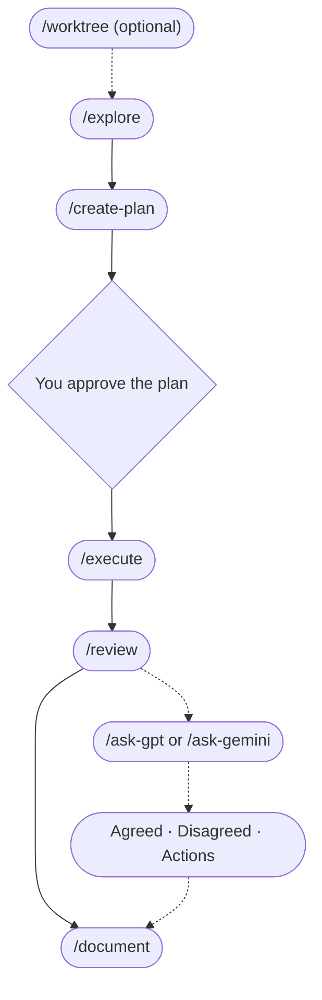

# LLM Peer Review

**AI peer review for your work. (Also: a structured workflow.)**


*A real `/ask-gpt` debate output: Claude and ChatGPT argue across up to three rounds and hand you a structured verdict (what they agreed on, where they disagreed, and a prioritized action list). You approve what gets implemented.*

This toolkit gives you slash commands for every step of a project: explore the problem, create a plan, build, review, then run a debate (up to 3 rounds) between Claude and ChatGPT (or Gemini). Works for product specs, research plans, competitive analysis, and code.

**Inspired by [Zevi Arnovitz's workflow on Lenny's Podcast](https://www.youtube.com/watch?v=1em64iUFt3U).** The key difference: Zevi manually copies feedback between models. This toolkit automates the entire debate loop with two commands (`/ask-gpt` and `/ask-gemini`).

This is the same consensus/divergence synthesis that [Perplexity's Model Council](https://www.perplexity.ai/hub/blog/introducing-model-council) produces and what [Karpathy's LLM Council](https://github.com/karpathy/llm-council) does for general Q&A, applied to a full project lifecycle with multi-round adversarial debate and an implementation workflow.

**New to slash commands?** A slash command is a shortcut you type into your AI editor's chat panel - it starts with `/` and tells the AI to run a specific workflow. The editors that support them are **Claude Code** (Anthropic's CLI plus editor panel for Claude) and **Cursor** (an AI-powered code editor built on VS Code). You'll need one of these installed; see [SETUP.md](SETUP.md) if you're starting from scratch.

---

## The Workflow



> **Solid arrows run on their own; dotted arrows you start yourself.** You type `/explore` and approve the plan. From there `/create-plan`, `/execute`, `/review`, and `/document` chain automatically. `/worktree` and the AI debates stay optional and always start with you.
>
> If the diagram doesn't render: you type `/explore` -> `/create-plan` writes the plan -> **you approve it** -> `/execute` -> `/review` -> `/document`. Optional and typed by you: `/worktree` before the run, `/ask-gpt` or `/ask-gemini` after the review.

You don't have to use every command every time. Following the order prevents the most common mistake: coding before you've thought it through.

**Two ways to take back control, and they do different things.** Say **"no chaining"** to stop the *handoff*: that run finishes its own stage and does not start the next one. Say **"report only"** to stop the *changing*: the run tells you what it found and edits nothing. They are deliberately separate, so you can have either without the other, and both last for one run only. One thing to know about a chained cycle: the review that follows `/execute` starts on its own, so there is no moment to type "report only" for it. If you want that review to change nothing, say "no chaining" when you approve the plan, then type `/review <start>..HEAD report only` yourself, with the `Start commit` sha `/execute` wrote at the top of the plan (a plain `/review` on a clean tree covers your newest 20 unpushed commits instead).

> **Want to see this in action?** Follow the 5-minute walkthrough in **[DEMO-SCRIPT.md](DEMO-SCRIPT.md)**.

> **Working on multiple things at once?** Use `/worktree` first to create an isolated copy, then open it in a new Cursor window and run `/explore` there.

---

## How key commands work

These commands carry most of the workflow. Each has its own prompt file with the full prompt (under `.claude/commands/`, or `.claude/skills/` for the ones that are skills, like `/error-analysis`); the summaries below are the "what is this, when do I use it" view.

### `/explore` - Understand before you build

Asks 3-4 focused questions about scope, success criteria, and constraints before any code is written. Has two modes: **scoping** (you have a concrete idea, pressure-test the scope) and **vision** (you're thinking big-picture, challenge the premise itself). It picks a mode by reading your input, then asks you to confirm. You can switch modes any time. Useful when you're not yet sure what you're actually building. When the conversation converges (no open questions left, and in vision mode a scope dial reading Hold or Reduce), it hands off to `/create-plan` on its own.

**The design workflow.** When the feature has a look (a page, a screen, a component), `/explore` runs a named "Design exploration" step. It checks whether your repo already has a design system and asks you once, then sets a load level: nothing to design, improve something that exists, or build something new. New work gets an idea list you react to, three seeded working prototypes side by side to pick from, and then, during `/execute`, a fresh-context design critic that scores each round until the design clears a bar or the round budget runs out. A repo that already has a design system keeps it: only layout, composition, motion, and copy vary, and anything further asks you first. Your repo's answers live in `DESIGN-PROFILE.md`, a file that is yours (seeded once by setup, never overwritten). Image and video generation are optional and sit behind your own keys; without a key the workflow hands you the prompt to run elsewhere and continues. The rules live in [`.claude/skills/shared/design-rules.md`](.claude/skills/shared/design-rules.md); the keys are covered in [API-KEYS.md](API-KEYS.md#media-generation-optional).

Full prompt: [`.claude/commands/explore.md`](.claude/commands/explore.md)

### `/create-plan` - Turn an idea into trackable steps

Produces a `plans/PLAN-*.md` file with status emojis (🟥 To Do, 🟨 In Progress, 🟩 Done) and a progress percentage at the top. Tags each step `[parallel]` or `[sequential]` so `/execute` knows what can run concurrently. Captures critical decisions and (for UI features) the design choices made during `/explore`. The plan becomes your single source of truth for the feature. It runs on its own after `/explore` converges, then **stops and waits for you** - approving the plan is the one human gate in the cycle, and nothing gets built until you say go.

Full prompt: [`.claude/commands/create-plan.md`](.claude/commands/create-plan.md)

### `/execute` - Build it, update the plan as you go

Walks through the plan step by step, updating status emojis and progress in real time. Spawns parallel agents for `[parallel]` steps, runs `[sequential]` steps in order. Small failures get at most 3 fix attempts per step. Stops on critical blockers (e.g. the plan assumed an API supports a feature it doesn't) instead of pushing through a broken plan. On a clean finish it hands off to `/review`; on a blocker it stops there and asks you.

Full prompt: [`.claude/commands/execute.md`](.claude/commands/execute.md)

### `/review` - Auto-detect what changed, run the right specialists, fix what they confirm

Looks at what changed (the commits `/execute` made, which it hands over as a range, or your unpushed commits, plus anything uncommitted; the report opens by naming that range) and dispatches the relevant review skills (`/review-code`, `/review-security`, `/review-ux`, `/review-plan`, `/review-browser`, `/review-deps`, `/review-copy`, and others) in parallel. Before you read anything, the combined findings pass a three-tier audit: every finding ships with a receipt (a runnable check, like a grep or a test) that actually gets executed, survivors face a fresh skeptic whose default is to refute, and Block-severity findings must survive a three-skeptic vote. The report shows only the survivors. Each finding is one sentence carrying the defect and its harm, a second only when it says who is hit or when it fires, and a fix line that states a cost, with the check that proves it attached. Everything the audit killed is listed one line each in an "Audited out" log, never fixed. Survivors are then fixed automatically, and each fix is re-verified (max 2 rounds) instead of assumed done - the run ends with a summary showing, for every fix, the check that proves it worked. Once the loop settles it hands off to `/document`, which finishes the cycle: docs updated, commits made, and (behind a secret-scanning tripwire) pushed. Your control points: you approved the plan before anything was built, the loop stops and asks whenever a decision genuinely needs a human (for example, edits to the toolkit's own prompt files), and two per-run phrases give you the wheel back - "report only" reports findings without changing anything, "no chaining" stops the handoff to the next stage.

Directly-typed `/review-*` runs are audited the same way before their reports - expect a few extra sub-agents (a skeptic per 7 findings, plus three voters for Block-severity findings) after the review itself, announced before they run. Loop rules: `.claude/skills/shared/hitl-loop.md`.

Full prompt: [`.claude/commands/review.md`](.claude/commands/review.md)

### `/ask-gpt` and `/ask-gemini` - Debate with another AI

Run a structured debate of up to 3 rounds between Claude and ChatGPT (or Gemini). They push back on each other, concede points, and produce a structured verdict: Agreed / Disagreed / Recommended Actions. Recommended Actions use the same two-sentence finding contract as `/review` (one sentence carrying the defect and its harm, a second only when it says who is hit or when it fires, and a fix line that states a cost), so the output model is consistent across all peer-review surfaces. Each debate typically costs $0.01-$0.10 in API credits. Requires API keys from OpenAI and/or Google AI Studio. See [API-KEYS.md](API-KEYS.md) for setup.

Full prompts: [`.claude/commands/ask-gpt.md`](.claude/commands/ask-gpt.md) | [`.claude/commands/ask-gemini.md`](.claude/commands/ask-gemini.md)

### `/error-analysis` - find out what you keep correcting

Every time you step in during a cycle, correcting Claude or asking for something different, `/document` records it as one row in a ledger with a short note in your own words about what went wrong. `/error-analysis` reads those notes across every cycle, groups them into categories, counts them, and ranks them, so the thing you fix is the one that actually keeps happening rather than the one that happened most recently. It refuses to rank on fewer than ten rows, because a ranking built on two data points is the exact mistake it exists to prevent.

Everything is recorded at `~/.claude/correction-ledger.jsonl`, per machine, outside every repo, so you can open it and read exactly what is stored. A row holds your note plus two short fields quoting what was said, capped at 300 characters each. Those two never leave your machine: they are excluded from every summary by construction, and this command never publishes and never sends anything to another model. To stop future capture in a repo, `touch .claude/.no-correction-log`. For a test run that should not touch your real ledger, set `TK_LEDGER_DIR` to an absolute folder: the ledger and its summary files are then written there, while capture still reads your real session transcripts. That records nothing further; rows already written stay until you delete the file yourself.

Full prompt: [`.claude/skills/error-analysis/SKILL.md`](.claude/skills/error-analysis/SKILL.md)

### `/create-issue` - issues that don't bloat

Asks 2-3 clarifying questions first, then creates a short (10-15 line) issue via `gh issue create` on GitHub or `glab issue create` on GitLab. It picks the right one by reading your git remote, so there is nothing to configure. No implementation details; that's what `/explore` and `/create-plan` are for. Good for capturing bugs and ideas without context-switching out of your editor.

Full prompt: [`.claude/commands/create-issue.md`](.claude/commands/create-issue.md)

---

## All Commands

| Command | What it does |
|---|---|
| `/explore` | Understand the problem, ask clarifying questions before implementation |
| `/create-plan` | Write a step-by-step plan with status tracking |
| `/execute` | Build it, updating the plan as you go |
| `/review` | Run the right reviews automatically, audit the findings (receipts plus skeptics), fix the survivors, re-verify every fix |
| `/review-code` (skill) | Code review (single pass or 4 sub-agents) |
| `/review-security` (skill) | Application security review of a code change - injection, secrets, XSS, path traversal, SSRF, weak crypto (runs inside /review on every code change) |
| `/review-commands` (skill) | Review slash command prompts for quality, workflow, and consistency |
| `/review-plan` (skill) | Check if implementation matches a plan file in `plans/` |
| `/review-ux` (skill) | UX review from code/markup - usability, accessibility, user flows |
| `/review-browser` (skill) | QA a running web app via headless browser - screenshots, interactions, diagnostics |
| `/review-full` (skill) | Pre-release cross-domain check with Ready / Not ready recommendation |
| `/review-deps` (skill) | Dependency and supply chain security review |
| `/review-copy` (skill) | Copy clarity and reader orientation review |
| `/security-audit` (skill) | Deep on-demand whole-repo security audit - entry points, authorization, crypto, secret-history scan (run deliberately, not part of /review) |
| `/peer-review` | Evaluate feedback from other AI models |
| `/document` | Update your README and docs to match what was built |
| `/error-analysis` (skill) | Group the correction ledger's open codes into categories, count them, and rank what you keep correcting |
| `/create-issue` | Create an issue on GitHub or GitLab (asks you questions first) |
| `/pair-debug` | Focused debugging partner - investigate before fixing |
| `/ask-gpt` | Debate your work with ChatGPT (up to 3 rounds) |
| `/ask-gemini` | Debate your work with Gemini (up to 3 rounds) |
| `/package-review` | Bundle your work into one file for external review |
| `/learning-opportunity` (skill) | Learn a concept at 3 levels of depth |
| `/codebase-to-course` | Turn any codebase into a visual learning guide |
| `/playground` (skill) | Generate throwaway interactive HTML to compare options, drag-to-reorder, toggle variants, or tune sliders |
| `/audit-html` (skill) | Scan your project's own markdown for files that would benefit from an HTML view. Report-only |
| `/worktree` | Create an isolated parallel session in a new worktree |
| `/index` | (Re)generate the project's `CODEBASE_MAP.md` (semantic map of modules, conventions, gotchas) |

> `/ask-gpt` and `/ask-gemini` run the full debate loop automatically. `/peer-review` is for when you paste feedback from an external tool manually.

#### Which review command do I use?

| I need to... | Use |
|---|---|
| Check code for bugs, logic, and quality | `/review-code` |
| Security-check a code change (injection, secrets, XSS, ...) | `/review-security` (auto-runs inside `/review`) |
| Check dependencies/packages for known vulnerabilities (CVEs) | `/review-deps` |
| Deep whole-repo security audit (auth, secrets, crypto, history) | `/security-audit` |
| Review slash command prompts and workflows | `/review-commands` |
| Verify implementation matches a plan | `/review-plan` |
| Evaluate UX, accessibility, and user flows | `/review-ux` |
| QA a running web app via headless browser | `/review-browser` |
| Check if copy is clear to a fresh reader | `/review-copy` |
| Pre-release go/no-go check across all domains | `/review-full` |

---

## Already Have Your Own Workflow?

The toolkit now runs as a **loop** rather than a set of one-shot commands, and that is the change most likely to affect you if you arrive with your own commands, scripts, or way of working.

**What "a loop" means here.** The old behavior was report-first: a command found problems, showed you a list, and waited. The new behavior is that a command finds problems, checks them, fixes the ones that survive the check, verifies the fixes, and hands off to the next stage on its own. You type `/explore` and approve the plan. The rest runs. Two phrases take control back: say **"report only"** on a run you start and it reports without changing anything (for the review that chains from `/execute`, see the note under "How key commands work"), or **"no chaining"** and it finishes that one stage without starting the next.

You do not have to give up what you already have. The loop is a pattern you can add to your own commands, and the rest of this section is how to do that safely, followed by what to check so your files survive an upgrade.

### Adding the loop to your own workflow

Automatic fixing is only safe because of what sits around it. If you take the "fix it automatically" half without these, you get the risk with none of the protection. In rough order of how much they matter:

| Add this | Why | Check your command |
|---|---|---|
| **An escape phrase** | Some runs you want to look before anything moves | Does your command honor "report only" by producing its report and changing nothing? If the phrase does nothing, you have no brake |
| **Proof attached to every finding** | A finding with no proof cannot be checked, so fixing it is guesswork | Does each finding carry a read-only command someone could run, plus a line saying what that output showed? |
| **A second opinion before the fix** | The thing that found a problem is the worst judge of whether it is real | Does anything with a fresh view check a finding before it gets fixed? Finder and judge must not be the same actor |
| **A different checker after the fix** | Models favor their own output and will not reliably catch their own mistakes | Does whatever wrote the fix also declare it verified? If yes, that verification is worth very little |
| **A retry limit and somewhere to fall back to** | Unbounded retrying is how an automatic command turns a small problem into a large one | Is there a number on the attempts, and a commit or checkpoint to revert to when they run out? |
| **A deletion guard** | A fix that restores something a person removed on purpose is a correct-looking regression | Before re-adding anything, does your command check whether a human deleted it deliberately? |

The short version: **auto-fixing is a privilege earned by verification.** Add the verification first and the automation second.

### Keeping your own files through an upgrade

**On the plugin (v7.0.0 and later), an update cannot touch your files:** `/plugin update` changes the plugin cache and nothing in your project. What can go stale is the other direction, your files referring to toolkit pieces that moved, and that is what `/tk:upgrade` audits: it reads the [conventions](docs/CONVENTIONS.md) that changed, finds each file of yours behind one, and fixes it through the loop after asking you once. Three habits keep that audit short: refer to toolkit pieces by name (`Skill(tk:<name>)`, `subagent_type=tk:<name>`) rather than by a `.claude/...` path; give your own agents a `skills:` line instead of pasting criteria; and never edit a toolkit script, because the plugin replaces it whole (file an issue instead).

**On a copy-install,** re-running setup is how you get toolkit updates, and it is also where custom work quietly disappears. These are worth checking once, before your next upgrade.

**Do not customize by editing a toolkit file.** Editing `.claude/commands/review.md` to add your own step works until the next upgrade copies the toolkit's version back over it. Put your customization in a file the toolkit does not ship.

**Do not use a name the installer reclaims.** These names were toolkit locations once, so setup backs them up and removes them without checking whose they are:

- In `.claude/commands/`: `review-code.md`, `review-ux.md`, `review-plan.md`, `review-commands.md`, `review-browser.md`, `review-full.md`, `learning-opportunity.md`, `dev-lead-gpt.md`, `dev-lead-gemini.md`
- In your project's top-level `scripts/`: `ask-gpt.js`, `ask-gemini.js`, `browse.js`, `dev-lead-gpt.js`, `dev-lead-gemini.js`
- At the root: `INDEX.md`

**Prefix your own files, or put them in a subfolder.** `.claude/commands/myteam/deploy.md` survives an upgrade byte for byte, and a prefix also protects you from names the toolkit adds in future versions.

**Check your root `package.json`.** Every setup run removes these five dependencies if it finds them: `openai`, `@google/generative-ai`, `@google/genai`, `playwright-core`, `@axe-core/playwright`. They belong to the toolkit and live in `.claude/scripts/` instead. It also removes `ask-gpt` and `ask-gemini` from your `scripts` block, but only when they still point at the retired `scripts/ask-gpt.js` path; a script of your own by that name pointing anywhere else is left alone. If your own code genuinely imports one of the five, re-add it after setup or restore it from the timestamped backup folder setup leaves behind.

**See all of this before it happens.** Run the installer with `--dry-run`. It changes nothing and prints what would happen:

```bash
bash /path/to/llm-peer-review/scripts/setup/setup.sh /path/to/your-project --dry-run
```

Your files listed under "Custom files detected" are safe. Anything under "Managed toolkit files that differ" is about to be replaced.

### If your command spawns subagents

**Give finder workers no ability to edit.** A worker that can both find problems and change files will apply its findings before anything has judged them, which removes the check that makes the loop safe.

**Preload the expertise; paste only the run.** A subagent starts blank: it does not inherit your conversation and does not discover skills on its own. Since v7.0.0 the answer is a `skills:` line in the agent's frontmatter, which loads a skill into the worker byte for byte on every dispatch (the toolkit's finders preload `tk:review-<kind>-criteria` and `tk:dispatch-contract` this way). The prompt then carries only what differs per run: project context, file excerpts, notes. A manual pasted into the prompt sits in the parent transcript once per dispatch and is the first thing compaction truncates.

**Have a branch for the worker that fails.** Decide in advance what happens when one errors, times out, or returns something you cannot parse.

### A few things that will bite regardless

**Give temp files a per-run unique suffix.** Two tabs open on the same project will otherwise overwrite each other's working files.

**Never read a credentials file into the conversation.** Anything read becomes part of the transcript, and transcripts get written to temp files, sent to other AI models by the debate commands, and rendered into HTML. Copy such files with `cp`, which moves the bytes without putting them in context.

**Put permissions in `.claude/settings.local.json`.** That file is yours and survives upgrades. A project-level `.claude/settings.json` survives too, because setup never touches it; the toolkit keeps its own permissions in `settings.local.json` because that is the file it seeds and merges.

**Do not overwrite a file a toolkit command opens by name:** `plans/PLAN-*.md`, `CODEBASE_MAP.md`, `LESSONS.md`, `LESSONS-detail.md`.

**One thing to expect rather than fix:** `/review` will not pick up your own reviewer automatically. Its specialist list is fixed, and subagents do not discover skills on their own. Type your command alongside it, or ask for it by name in the session.

---

## Requirements

The plugin needs **Claude Code** with plugin support (2.x). It is tested on Linux under WSL. Native Windows is untested: the plugin keeps the stable path the rules file names (`~/.claude/plugins/data/tk-llm-peer-review/current`) as a symbolic link, and on Windows without symlink rights that link is silently not created, so open the manual from the plugin cache instead. The copy-install for other editors runs on **macOS, Linux, or WSL** (Windows Subsystem for Linux). Windows users: [install WSL](SETUP.md#step-4-optional-install-wsl-if-you-prefer-a-bash-workflow) first. Native Windows PowerShell also works for setup and all non-debate commands; only `/ask-gpt` and `/ask-gemini` require bash/WSL.

---

## What's New

**Latest release: v7.1.0** (September 2026), safe distribution on top of v7.0.0: the plugin installs from the release tag, each session says when your project and the plugin are on different versions, your project's own `.env.local` is read again, and `/tk:upgrade` repairs projects migrated on 7.0.x. [What v7.1.0 adds](#what-v710-adds) has the details. v7.0.0 made the toolkit a Claude Code **plugin**: install it once per machine, seed each project with `/tk:setup`, and update with `/plugin update` followed by `/tk:upgrade`, which audits the files you wrote yourself against the conventions that changed and fixes what drifted through the same audit-and-fix loop reviews use. Under the hood every review dispatch goes to a typed finder agent that already carries its criteria, so nothing is pasted per dispatch and a review that compacts mid-run loses nothing. [What v7.0.0 adds](#what-v700-adds) has the details; the copy-install scripts still work for other editors.

The copy-install clones `main`, not a tag, so it gets everything on this page, not just the tagged release; the plugin installs the tagged release (from 7.1.0 on). The bullets directly below describe v6.0.0; [What v6.1.0 adds](#what-v610-adds), [What v6.2.0 adds](#what-v620-adds), [What v6.3.0 adds](#what-v630-adds), [What v7.0.0 adds](#what-v700-adds), and [What v7.1.0 adds](#what-v710-adds) list what the newer releases build on top of it. See the CHANGELOG for the full split.

- **The loop no longer stops at a report.** A review used to hand you a list and wait for "fix it". It now fixes the findings that survived its own audit, re-verifies each fix with something other than whatever made it, and starts the next stage on its own. Two per-run phrases take control back, and they do different things: say **"report only"** and the run changes nothing, say **"no chaining"** and it finishes its stage without starting the next. Nothing was renamed or removed; what changed is what a command does once it starts.
- **Findings have to prove themselves before you see them.** Every finding now ships with a receipt (a read-only command, plus what its output must show), and the run executes it. What survives goes to a fresh skeptic told to refute it, and a Block-severity finding faces three. Expect shorter reports: the first live run killed four of seven findings. What was thrown out is listed rather than hidden.
- **Nothing gets pushed without a secret scan.** A tripwire reads every outgoing commit before any push the loop makes, looking for secrets, never-push files, and changes to shared settings. It reads commit by commit rather than the final diff, because a secret added and then removed leaves no trace at the end but still lands in history.
- **It works on GitLab now, not just GitHub.** Commands read your git remote and pick `gh` or `glab` from what they find, so there is nothing to configure at setup time. GitHub is unchanged.
- **HTML artifacts gained a second viewport.** Plans, reviews, and cycle summaries still open in your local browser as before; when the session can publish, it asks your consent, then publishes the same file as a private Claude-hosted page and gives you the link. Purely additive in this release: if publishing is unavailable, nothing is lost. Every publish is recorded in `artifacts/html/index.jsonl`, and each page is named from its own title. (v6.1.0 then made the hosted page the primary viewport and dropped the ask; see [What v6.1.0 adds](#what-v610-adds).)

Upgrading from v5.2.0 or earlier? v6.0.0 also carries v5.3.0 (the application-security review domain) and v5.4.0 (bounded, verifier-gated loops) - one re-run of setup picks up all of it.

### What v6.1.0 adds

Released 2026-09-01 on top of v6.0.0. Nothing here changes the auto-by-default behavior above; it builds on it. A re-run of setup picks all of it up; [Update an Existing Project](#update-an-existing-project) lists what an upgrade touches.

- **A correction ledger.** `/document` now records each time you stepped in during a cycle, with a note in your own words about what went wrong, and `/error-analysis` groups and ranks those notes so you fix what keeps happening. Rows live under `~/.claude/` on your machine, outside every repo, are never published or sent to another model, and the two fields that quote what was said stay out of every summary. Opt a repo out with `touch .claude/.no-correction-log`; a one-time backfill of older transcripts also exists, run only when you ask and only for the repo you name (documented in the `error-analysis` skill).
- **The hosted page is now the primary viewport.** Plans, reviews, cycle summaries and the rest are published to a private Claude-hosted page under claude.ai and you get the link. The local browser open is the fallback for a session that cannot publish (Cursor, or the feature turned off). Exactly one viewport opens either way, never a bare file path.
- **Publishing no longer asks for consent, for any artifact type, reviews and debates included.** The page is private under your own account and the toolkit never changes its sharing setting, so it is not an outward-facing send under the loop's always-ask rule (M9). Everything else on that rule still asks (prompt-file edits, releases, data deletions, force pushes, sharing a page, any other send); its other exemption, the pull request `/document` opens at the end of a chained cycle, is unchanged. Two trade-offs: a review or debate page can hold findings you have not read yet (Claude states its contents in one clause with the link), and updating a shared page reaches everyone you shared it with.
- **Every published file carries its hosted URL on line 1.** Finding the page a local file was published to used to mean opening the index; now the file's first line says it, as an HTML comment: `<!-- hosted: <url> -->`. Markdown twins (`PLAN-*.md`) are not stamped.
- **Dark mode, machine-path stripping, and GitLab fixes.** Every shell renders in dark mode when your viewer's theme is dark, and `--no-abs` now strips editor links and rewrites the repo root and home directory out of page text. Browser QA screenshots are inlined into the page so they survive publishing, and the GitLab column of `host-cli.md` was run end to end against a live repo, fixing three defects. One caveat remains untested: `--output json` versus `-F json` on older glab builds.
- **Installers.** `setup.ps1` now matches `setup.sh` on the `settings.local.json` permission merge, legacy `INDEX.md` cleanup, and the `.claude/plans/` to `plans/` migration, so Windows upgrades finally receive new permission entries. Both installers back up more (the previous manifest, the pre-merge `.gitignore` and `settings.local.json`) and gate the run on a file of yours sitting at a path the toolkit newly ships, instead of replacing it silently. The guarantee suites grew to 129 checks (bash) and 148 (PowerShell), each new check confirmed to fail when its behavior was broken on purpose; [CHANGELOG.md](CHANGELOG.md) and [Update an Existing Project](#update-an-existing-project) list the rest.
- **The review loop.** Directly-typed `/review-*` runs that fan out sub-agents now dedup with the same rule as `/review`: a merged finding keeps the highest severity of its sources. `/peer-review` is no longer listed as an HTML call site.

### What v6.2.0 adds

Released 2026-09-02 on top of v6.1.1. Nothing here changes how the loop runs; it adds a design step to it. A re-run of setup picks all of it up.

- **A design step in `/explore`.** When a feature has a look, `/explore` names the step, checks whether your repo already has a design system and asks you once, and sets a load level: nothing to design, improve something that exists, or build something new. New work gets an idea list you react to and three seeded working prototypes side by side to pick from. A repo with a design system keeps it: only layout, composition, motion, and copy vary inside one, and anything further asks you first.
- **A design critic in `/execute`.** A fresh-context `design-critic` agent sees only a screenshot and scores each round out of 10 until the design clears the bar or the round budget runs out (loop rule M15: up to 5 rounds for new work, 2 for an improvement, best-scoring round kept). Polish runs inside every fix pass.
- **Media generation, optional.** `gen-media.js` prints the seed strings and can generate images (your OpenAI or Gemini key), video, and matted video (an optional `FAL_KEY`). With no key it hands you the prompt to run elsewhere and the workflow continues. See [API-KEYS.md](API-KEYS.md#media-generation-optional).
- **`DESIGN-PROFILE.md`, yours.** Setup seeds it once and never overwrites it; it remembers the design-system answer, what may vary, your taste notes, directions tried with their seeds, and prompts worth retrying on a newer model.
- **One permission to check.** The design step calls `node .claude/scripts/gen-media.js`, which needs `Bash(node .claude/scripts/gen-media.js *)` in `.claude/settings.local.json`. v6.2.0 copied the script but never seeded the row, so the first design run prompted until you added it by hand; setup now merges the row like every other toolkit permission (#165). If a design run still prompts, your install predates the fix - re-run setup.

### What v6.3.0 adds

Released 2026-09-03 on top of v6.2.0. Nothing here changes the auto-by-default behavior above; it changes what a review finding says and where the review page lives. A re-run of setup picks all of it up.

- **A finding is one sentence, sometimes two.** The old four-field structure (What / Why it matters / Example / Suggested fix) required four fields whether or not there were four things to say, and told the reviewer to drop anything not worth four fields. The only way to report a small true thing was to inflate it. Now: one sentence of 18 words or fewer opening with the severity in words, an optional second sentence only when it says who is hit or when it fires, and a fix line that states a cost rather than an approach.
- **Reviews show you the machine's own output.** Every finding already carried a check that the audit ran and then threw away. Its output is now attached to the finding, read off disk by the renderer rather than retyped by a model.
- **The length caps are enforced in code.** A word budget had been asked for in nine different places and ignored every time. The renderer counts, reports over-runs before you get the link, and demotes the lowest-ranked findings to one-line rows rather than truncating anything.
- **One standing review page per repository.** It replaces itself, carries only what is open, tells you what changed since you last opened it, and can go empty. The full report is written to `reports/` every run.
- **The plan page updates as work happens**, instead of showing every step as not started forever.
- Re-rendering the three largest real past reports cuts them **60%, 67% and 80%**.

**v6.3.1** (2026-09-03) is the patch that made the second and fourth bullets above true in a real run: the audit now writes the receipt file the page reads, the page is rendered once per run after the fix loop, a focused `/review-*` run merges into it instead of overwriting it, and the twenty-seven defects the v6.3.0 review found are fixed. [CHANGELOG.md](CHANGELOG.md) has the list.

### What v7.0.0 adds

Released 2026-09-12 on top of v6.3.3 (#167). The loop is unchanged; what changed is how the toolkit reaches your project and how a review carries its expertise.

- **It is a plugin.** `/plugin marketplace add mayankmankhand/llm-peer-review`, `/plugin install tk@llm-peer-review`, then `/tk:setup` in each project. The commands, skills, agents, and scripts live in the plugin cache and never in your project; a project keeps a short, version-stamped rules file and its own files. Commands carry the `tk:` prefix (`/tk:explore`, `/tk:review`).
- **Upgrades are audited, not copied over.** `/plugin update tk@llm-peer-review` moves the plugin; `/tk:upgrade` then reads the [conventions](docs/CONVENTIONS.md) that changed since the version your project was last audited against, turns every file of yours that is behind one into a finding with a receipt, and runs it through the normal M2 audit and auto-fix loop, stopping once to ask before it edits your prompt files. A copy-install migrates the same way: `/tk:setup` backs up and removes the toolkit's files, keeps yours, and hands off to `/tk:upgrade`.
- **Every review dispatch goes to a typed finder.** Eight `review-<kind>-finder` agents preload their criteria and the dispatch contract through their own `skills:` line, so the orchestrator pastes only project context and file excerpts. The M2 skeptics and M3 verifiers are typed too (`audit-skeptic`, `fix-verifier`), with no edit tools, and `/create-plan` scores each plan with a fresh-context `plan-critic` before the approval stop.
- **The always-on rules got short.** The long manual moved into the plugin (`toolkit-reference`), and the HTML output rules load with the commands that render HTML instead of every turn.

### What v7.1.0 adds

Released 2026-09-14 on top of v7.0.0 (#172 to #177). The loop is unchanged; what changed is how safely an update reaches your project.

- **Updates come from release tags.** The plugin installs the tagged release, so work merged to `main` reaches nobody until it is released, and a release cannot be tagged while a test suite fails or the plugin changed without a version bump.
- **You are told when versions differ.** Each session start compares your project's recorded toolkit version with the running plugin and says to run `/tk:upgrade` when the plugin is newer, or warns when it is older; a push from an older plugin is blocked. It also notices an old copy-install still sitting beside the plugin.
- **Your project's `.env.local` works again.** Keys are read from the environment, then the project's `.env.local`, then `~/.claude/plugins/.env.local`, and only the toolkit's key and model variables are taken from those files.
- **Setup writes files meant for your project** (no toolkit-repo permissions, no `acceptEdits` default), recognizes copy-installs old enough to have no manifest, and prints an undo line that restores the tree when followed in order.
- **`/tk:upgrade` repairs 7.0.x migrations.** New checks put back permission rows and `.gitignore`/`.gitattributes` lines a 7.0.0 migration removed, drop rows the old seed added, ask before touching `defaultMode`, flag a migration record git still tracks, and add the `tk:` prefix where your own files name toolkit pieces without it.

Full history: the [version-by-version rollup in CHANGELOG.md](CHANGELOG.md#whats-new-since-v433) or the [GitHub releases page](https://github.com/mayankmankhand/llm-peer-review/releases).

---

## Add to a New Project

Since v7.0.0 the toolkit is a Claude Code plugin. Nothing is copied into your project except a short rules file and a few seed files; the commands, skills, agents, and scripts live in the plugin and update in one command. Other editors keep the copy-install below.

### Install the plugin (Claude Code)

Inside Claude Code, from any folder:

```
/plugin marketplace add mayankmankhand/llm-peer-review
/plugin install tk@llm-peer-review
```

Or from a terminal: `claude plugin marketplace add mayankmankhand/llm-peer-review && claude plugin install tk@llm-peer-review -s user`. Restart Claude Code or run `/reload-plugins`, and the commands appear under the plugin's prefix: `/tk:explore`, `/tk:review`, `/tk:document`, and the rest. The plugin installs its own runtime packages (for `/tk:ask-gpt`, `/tk:ask-gemini`, `/tk:review-browser`) from its lockfile; nothing lands in your project's `package.json`.

### Seed your project

Open your project in Claude Code and run `/tk:setup`. On a fresh project it writes the short rules file `.claude/rules/toolkit.md`, `LESSONS.md`, `DESIGN-PROFILE.md`, `CLAUDE.md` (a short template: a Toolkit section plus project sections that are yours to fill in), the `plans/` and `artifacts/` folders, the gitignore lines, and a pointer to the marketplace in `.claude/settings.json` so a collaborator's Claude Code offers the install. Every file is write-when-absent: your existing files are never overwritten. The permission rows are the one list setup merges into an existing file: it backs up `.claude/settings.local.json` and `.claude/settings.json` before changing either, names every row it adds or removes, never adds back a row you deleted in that working copy, and stops without writing anything when a settings file does not parse. On a project that carried the copy-installed toolkit, it migrates instead; see [Update an Existing Project](#update-an-existing-project).

### Optional: API keys and Chromium

- `/tk:ask-gpt`, `/tk:ask-gemini`, and the design workflow's media helper look for each key in a real environment variable first, then in the project's own `.env.local` (from the folder the command runs in up to the git root), then in `~/.claude/plugins/.env.local` (one file shared by every project on the machine). Only the toolkit's own key and model variables are read from those files. [API-KEYS.md](API-KEYS.md) walks through it.
- `/tk:review-browser` needs Chromium once per machine: `npx --prefix ~/.claude/plugins/data/tk-llm-peer-review/current playwright-core install chromium` (on Linux and WSL also `sudo npx playwright-core install-deps chromium`). That `current` path is a link the plugin keeps pointing at its installed version.

### Cloning a project that uses the toolkit

A clone carries the project's `.claude/settings.json`, which names the toolkit's marketplace and switches the plugin on, but not the plugin itself and not your local permissions. On a machine that has not installed the toolkit:

```bash
claude plugin marketplace add mayankmankhand/llm-peer-review
claude plugin install tk@llm-peer-review
```

Then restart Claude Code, open the project, and run `/tk:setup`: it writes the permission rows, which live in `.claude/settings.local.json` and are never committed. Opening the project in Claude Code and trusting the folder adds the marketplace from the project's settings too, and Claude Code then shows the same install command.

### Recommended for a hands-off install: tell your AI agent

Paste this into Claude Code's chat and it will run the steps above for you:

> "Set up the workflow from this repo in my project. Follow the instructions in https://github.com/mayankmankhand/llm-peer-review/blob/main/AGENT-SETUP.md"

[`AGENT-SETUP.md`](AGENT-SETUP.md) has the step-by-step instructions written for AI agents, for both the plugin and the copy-install.

### Copy-install for other editors (Cursor, Codex, and any editor without Claude Code plugins)

The setup scripts copy the same files into your project the way every release before 7.0.0 did. They stay supported until the per-editor layouts land (#144); Claude Code users should prefer the plugin, because a copy-install cannot be audited by `/tk:upgrade` and its scripts are replaced whole on every re-run.

#### Manual Setup (run the script yourself)

Prefer to run the setup script yourself? Pick the script that matches your shell:

**Bash (WSL, macOS, Linux):**
```bash
bash /path/to/llm-peer-review/scripts/setup/setup.sh /path/to/your-project
```

**PowerShell (setup and non-debate commands - see [Requirements](#requirements)):**
```powershell
powershell -ExecutionPolicy Bypass -File C:\path\to\llm-peer-review\scripts\setup\setup.ps1 -Target "C:\path\to\your-project"
```

Or run from inside your project directory (no target needed):
```bash
cd /path/to/your-project
bash /path/to/llm-peer-review/scripts/setup/setup.sh
```

> **Note:** If you run the script from inside the toolkit repository without specifying a target, it shows an error to prevent accidentally copying files into the wrong place.

**Preview first (optional):** add `--dry-run` (bash) or `-DryRun` (PowerShell) to see exactly what an install or upgrade would do - version gap, migrations, files that would be overwritten, custom files that are left alone, and where backups go - without changing anything:

```bash
bash /path/to/llm-peer-review/scripts/setup/setup.sh /path/to/your-project --dry-run
```

Every real run prints the same pre-flight report before it touches anything.

**Local edits are guarded:** if you edited a toolkit-managed file, setup detects it (via a hash manifest at `.claude/.toolkit-manifest.json`) and asks before overwriting - in a terminal it prompts, in scripts and AI-agent runs it stops and lists the files. Add `--force` (bash) or `-Force` (PowerShell) after the target path to proceed without the prompt; every replaced file is still backed up first and listed at the end of the run. The guard needs the hash manifest to compare against, so it applies from the second run onward: a first install into a project that already keeps its own root `VERSION` or `.gitattributes` replaces them with a backup and no prompt (the pre-flight labels them "provenance unknown").

**What setup does:**
- **Copies into your project:** commands, skills (including the prebuilt HTML shells), agent definitions (`.claude/agents/` - the worker roles `/review`, `/index`, `/document`, and `/execute` dispatch, carrying their model, effort, and tool settings), both rules files (`toolkit.md`, `html-outputs.md`), and all runtime and helper scripts (`ask-gpt.js`, `env-local.js`, `ask-gemini.js`, `browse.js`, `generate-index.js`, `render-html.js`, `session-init.js`, `pre-push-check.js`, `correction-ledger.js`, `gen-media.js`, `open-artifact.sh`), plus `VERSION` and `.env.local.example`. Detects and removes any legacy `INDEX.md`. `CODEBASE_MAP.md` (a semantic map of your project) is generated on your first `/explore` run, when Claude auto-invokes `/index`. Setup also lands `.gitignore` (merged, not overwritten), `.gitattributes`, `VERSION`, `artifacts/README.md`, and the quarantined `.claude/scripts/package.json` and `package-lock.json`, and creates an empty `plans/` folder for your plan files.
- **Preserves your work:** `CLAUDE.md`, `LESSONS.md` (plus its companion `LESSONS-detail.md`), `DESIGN-PROFILE.md` (the design workflow's per-repo answers, see `/explore` above), and `settings.local.json` are skipped if they already exist - those are yours to customize. Custom files you add inside `.claude/commands/`, `.claude/skills/`, `.claude/agents/`, `.claude/scripts/`, or `.claude/rules/` are never modified or deleted (the toolkit's installer test suite plants a custom file in each of those folders, `.claude/agents/` included, and checks it survives an upgrade byte for byte), and anything setup does overwrite is backed up to a timestamped `.toolkit-backup-*` folder first. One thing setup does add to `settings.local.json` even on a first install: the two `browse.js` permission entries that need your project's absolute path, so `/review-browser` runs without a prompt.
- **Always updates:** the managed rules files (`.claude/rules/toolkit.md`, `.claude/rules/html-outputs.md`).
- **Stays in the toolkit repo:** setup scripts (`setup.sh`, `setup.ps1`, `install-alias.*`) are never copied.

See [How It Works](#how-it-works-file-architecture) for details on which files are yours vs. managed by the toolkit.

#### Reusable Command (for multiple projects)

Install a `setup-claude-toolkit` command you can run from anywhere:

**Bash (WSL, macOS, Linux):**
```bash
cd /path/to/llm-peer-review
bash scripts/setup/install-alias.sh
source ~/.bashrc  # or ~/.zshrc for zsh
```

**PowerShell (native Windows):**
```powershell
cd C:\path\to\llm-peer-review
powershell -ExecutionPolicy Bypass -File scripts\setup\install-alias.ps1
. $PROFILE  # Reload profile (or restart PowerShell)
```

> **Note:** If you don't have a PowerShell profile yet, the installer will create one for you automatically.

Then use it from anywhere:
```bash
setup-claude-toolkit /path/to/your-project
```

<a id="advanced-do-it-manually"></a>
<details>
<summary><strong>Advanced: Do It Manually</strong></summary>

Copy these into your project:

| What to copy | Where it goes |
|---|---|
| `.claude/commands/` (whole folder) | `your-project/.claude/commands/` |
| `.claude/skills/` (whole folder) | `your-project/.claude/skills/` |
| `.claude/agents/` (whole folder) | `your-project/.claude/agents/` |
| `.claude/rules/toolkit.md` | `your-project/.claude/rules/toolkit.md` |
| `.claude/rules/html-outputs.md` | `your-project/.claude/rules/html-outputs.md` |
| `.claude/settings.local.json` | `your-project/.claude/settings.local.json` |
| `.claude/scripts/` (`ask-gpt.js`, `env-local.js`, `ask-gemini.js`, `browse.js`, `correction-ledger.js`, `gen-media.js`, `generate-index.js`, `open-artifact.sh`, `pre-push-check.js`, `render-html.js`, `session-init.js`, `package.json`, `package-lock.json`) | `your-project/.claude/scripts/` |
| `CLAUDE.md` | `your-project/CLAUDE.md` |
| `LESSONS.md` | `your-project/LESSONS.md` |
| `LESSONS-detail.md` | `your-project/LESSONS-detail.md` |
| `.claude/skills/shared/design-profile-template.md` | `your-project/DESIGN-PROFILE.md` (seeded once, never overwritten) |
| `.env.local.example` | `your-project/.env.local.example` |
| `.gitignore` | `your-project/.gitignore` |
| `.gitattributes` | `your-project/.gitattributes` |
| `artifacts/README.md` | `your-project/artifacts/README.md` |

Then in your project folder:
```bash
# One install covers everything - it stays inside .claude/scripts/ so your
# project's own package.json is never touched.
npm install --prefix .claude/scripts

# For /ask-gpt and /ask-gemini, set up your API keys:
cp .env.local.example .env.local
# Open .env.local and paste your API keys

# For /review-browser, install the Chromium browser:
npx --prefix .claude/scripts playwright-core install chromium
# On Linux/WSL, also: sudo npx playwright-core install-deps chromium
```

> The debate commands and the browser command are optional. Skip the API keys if you don't want `/ask-gpt` and `/ask-gemini`. Skip the Chromium install if you don't want `/review-browser`. The core workflow commands work either way.

</details>

> **Never set up a dev environment before?** Follow the step-by-step guide in **[SETUP.md](SETUP.md)**. It covers Windows (WSL), Mac, Node.js, GitHub CLI, Cursor, and API keys - everything you need from scratch.

> **Not using Cursor?** The setup guide assumes Cursor, but the toolkit works with any editor that supports Claude Code. Copy the relevant setup page into any AI assistant and ask it to rewrite the steps for your editor.

---

## Update an Existing Project

### On the plugin (v7.0.0 and later)

```
/plugin marketplace update llm-peer-review
/plugin update tk@llm-peer-review
```

From a terminal, the same two steps are:

```bash
claude plugin marketplace update llm-peer-review
claude plugin update tk@llm-peer-review
```

Keep the first step: `claude plugin update` on its own does not fetch the marketplace's catalog, so it would not see a new release. For a plugin installed for one project only, run the second step as `claude plugin update tk@llm-peer-review --scope project` from that project. Restart Claude Code or run `/reload-plugins`. That moves the plugin; your project has not changed. Then run `/tk:upgrade` in every project on the plugin; the session notice asks for it in each project that is behind. It checks more than your own commands, skills, agents, rules and `CLAUDE.md`: it also checks `.claude/settings.local.json`, and since 7.1.0 it compares that file's rows with the seed and reads `.gitignore`, `.gitattributes`, `artifacts/README.md`, and a migration record git still tracks, and the rules-file check (C-7) runs on every upgrade. It opens the cycle's issue, reads the [conventions](docs/CONVENTIONS.md) that changed since the version the project was last audited against, and turns every file of yours that is behind one into a finding with a receipt: a command that still dispatches the old generic finder, a prompt that pastes review criteria, an agent with edit tools in a reviewer role, a path into `.claude/skills/shared/` that no longer exists in the project. The findings go through the same M2 audit and auto-fix loop a review uses, stopping once to ask, with every prompt file listed, before the first edit, then one sample `/tk:review` proves the loop on the new version and `/tk:document` records the cycle. A project with nothing behind is told so in one line.

Your own files are never overwritten by an update, because the update touches only the plugin cache. The two files the toolkit does write into a project, the short rules seed and the state file `.claude/.toolkit-state.json`, are the ones `/tk:upgrade` stamps.

#### Version notices

Updates reach you from tagged releases, not from every commit on main. Each project records the toolkit version it was last set up or audited at, and when a session starts on a different plugin version, Claude tells you at the start of its first reply:

- **The plugin is newer than the project.** Run `/tk:upgrade` in the project. Nothing is blocked in the meantime.
- **The plugin is older than the project** (a collaborator upgraded the project first, for example). The pre-push check the toolkit runs before its own pushes (and any git hook your project wires to it) blocks the push until you update the marketplace and then the plugin, as above (`/plugin marketplace update llm-peer-review`, then `/plugin update tk@llm-peer-review`), and restart Claude Code, because an older plugin checks outgoing commits with older rules than the project was set up with. A push you type by hand in a project with no such hook is not checked.
- **The old copy-install still sits beside the plugin.** Run `/tk:setup` to migrate it, so you stop running the stale unprefixed commands by accident.

### Automatic updates

Off unless you turn them on: Claude Code leaves automatic updates off for third-party marketplaces such as this one, and setup never changes that. To turn them on, run `/plugin`, open **Marketplaces**, choose `llm-peer-review`, and select **Enable auto-update**. Claude Code then checks for a new release in the background after a session starts, and the new version loads after `/reload-plugins` or at the next launch; run `/tk:upgrade` in each project once it has. Setting the `DISABLE_AUTOUPDATER` environment variable turns every automatic update off. Turn automatic updates off before going back to an earlier release, so nothing moves you forward again unasked.

### Going back to an earlier release

1. In each project that uses the toolkit, while the newer release is still installed, lower the version the project records to the release you are going back to (here 7.1.0), then commit `.claude/.toolkit-state.json`:

   ```bash
   node ~/.claude/plugins/data/tk-llm-peer-review/current/scripts/upgrade-audit.js --rollback-to 7.1.0
   ```

   An older release's pre-push check blocks every push from a project that records a newer version, and this command is the one way to lower the record. It prints each value it changed.
2. Replace the plugin with the older release, with the marketplace pinned to that release's tag:

   ```bash
   claude plugin uninstall tk@llm-peer-review --keep-data
   claude plugin marketplace remove llm-peer-review
   claude plugin marketplace add mayankmankhand/llm-peer-review@v7.1.0
   claude plugin install tk@llm-peer-review
   ```

   Then restart Claude Code. Uninstall with `--keep-data` first: removing the marketplace while the plugin is still installed also deletes the plugin's data folder. For a plugin installed for one project only, add `--scope project` to the uninstall and install lines and run them from that project.
3. If you reinstalled before step 1, the older release's push check blocks and names both versions. In each project, open `.claude/.toolkit-state.json`, set each of `version`, `previousVersion` and `auditedVersion` that is above the older release to that release (`7.1.0`), and commit the file.

To return to the newest release, run step 2 with `claude plugin marketplace add mayankmankhand/llm-peer-review` (no tag) in its third line, restart Claude Code, and run `/tk:upgrade` in each project.

### Moving a copy-install (v6.x or earlier) to the plugin

Install the plugin, then run `/tk:setup` in the project. It detects the copy-install, classifies every managed file against the installer's manifest, and stops to ask about any file you edited locally (each one is backed up and becomes an `/tk:upgrade` finding under C-6 whose receipt is the migration record's line for the file plus two hashes, the one the old manifest recorded and the backup copy's; the base to diff your edit against is the same file at the toolkit tag for the version the backup came from, not the current plugin copy). An install old enough to have no manifest is recognized too, by `VERSION` beside `.claude/commands/review.md` or by an early stamp in its rules file; every file it finds is of unknown provenance, so the run stops until you rerun with `--force`. Helper scripts an early installer copied into your root `scripts/` folder are removed with the rest (backed up first), while every other file there is left alone, and a `VERSION` file of your project's own is kept. On a clean or approved run it backs up and removes the toolkit's files, keeps every custom file, seeds the short rules file, merges the marketplace pointer and permissions (backing up both settings files first and naming every row it adds or removes), records the migration, and hands off to `/tk:upgrade`, which audits your custom files against every convention since the version you came from. The report ends with a one-line `Undo:` built from what that run actually did. Follow it left to right: `git checkout --` the tracked files it names, then delete the files it created (and its new folders, if empty), then copy the listed files back from the backup folder it names (or restore by hand the few it says git holds no copy of), then remove that backup folder. Use that line rather than a generic checkout, which would leave the new files in place and skip what only the backup holds. The first push after the migration stops to ask about the settings change, which is the tripwire doing its job. Your API keys need no move: the plugin's scripts read the project's own `.env.local` (after a real environment variable, before `~/.claude/plugins/.env.local`), so the file the copy-install used keeps working (see [API-KEYS.md](API-KEYS.md)).

### Copy-install updates (other editors)

Re-run the same setup command (or ask your AI agent to follow [`AGENT-SETUP.md`](AGENT-SETUP.md) again); it is safe to rerun, and the list below says exactly what it touches.

**What an upgrade touches:**

- **Overwritten** (tracked in the manifest, backed up first when they differ): `.claude/commands/*.md`, `.claude/agents/*.md`, all of `.claude/skills/` (including `shared/` and its shells), `.claude/rules/toolkit.md` and `html-outputs.md` (version-stamped), the toolkit scripts in `.claude/scripts/` (`ask-gpt.js`, `env-local.js`, `ask-gemini.js`, `browse.js`, `generate-index.js`, `render-html.js`, `session-init.js`, `pre-push-check.js`, `correction-ledger.js`, `gen-media.js`, `open-artifact.sh`, plus `package.json` and `package-lock.json`), `VERSION`, `.gitattributes`, `.env.local.example`, and `artifacts/README.md`.
- **Preserved** (skipped if present): `CLAUDE.md`, `LESSONS.md`, `LESSONS-detail.md` (seeded only on a fresh install), `DESIGN-PROFILE.md` (seeded from the installed template), and `.claude/settings.local.json` (kept, with new toolkit permissions merged in).
- **Merged in place:** `.gitignore` (missing toolkit lines appended, comments skipped, no duplicates) and the permissions list in `.claude/settings.local.json` (missing template entries added, known-stale entries removed). Only that permissions list is merged; every other top-level setting in `settings.local.json` (such as `defaultMode`) is left alone. A project-level `.claude/settings.json` is never touched.
- **Migrated when needed** (backed up first): command files that became skills (v3.5), `.claude/plans/` to `plans/` (v4.0), the old top-level `scripts/` location to `.claude/scripts/`, toolkit dependencies stripped from your root `package.json`, and a legacy `INDEX.md` removed (`/index` builds `CODEBASE_MAP.md` in its place).

**Before you upgrade.** The gate that stops a run when you edited a managed file is the one described under "Local edits are guarded" in [Manual Setup](#manual-setup-run-the-script-yourself) above. An install from before v5.5.0 has no manifest, so that gate cannot fire: its differing managed files show as `[differs, provenance unknown]` in the pre-flight and are replaced with a backup, with no prompt. For those, run `--dry-run` / `-DryRun` first, read that list, and copy anything you customized out of the backup folder afterwards. One more thing to know: a project that keeps its own root `VERSION` file or its own `.gitattributes` will have it replaced (backed up).

**If you need to undo it.** Setup creates `.toolkit-backup-<YYYYMMDD-HHMMSS>-<pid>` at the project root, and only when something is replaced or deleted. It holds every replaced managed file at its original relative path, files removed by a migration, your root `package.json` when it was cleaned, the previous `.claude/.toolkit-manifest.json`, and the pre-merge `.gitignore` and `.claude/settings.local.json`. Rollback is manual: copy files from the backup folder back to the same relative paths, manifest included. Files the upgrade *added* are not in the backup, but the restored manifest tells you which they are: open `.claude/.toolkit-manifest.json`; every path under `"files"` is one the toolkit tracks. Anything under `.claude/commands`, `skills`, `agents`, `scripts`, or `rules` that is not listed there and that you did not create was added by the upgrade and can be deleted. Leaving them is harmless; the next setup treats them as custom files. You can re-run setup later whenever you are ready.

**After upgrading:**

- Run `/index` if `CODEBASE_MAP.md` is missing or the upgrade removed an `INDEX.md`.
- If setup cleaned toolkit dependencies out of your root `package.json` (installs from before v4.3), run `npm install` at the project root so `package-lock.json` matches; setup does not touch the lock file.
- If your `CLAUDE.md` still says "report first" or carries a "CRITICAL RULES" block from an older version, retire that wording: the loop is auto by default from 6.0.0, and "report only" is a per-run phrase now.
- Permission entries in a project-level `.claude/settings.json` are yours to clean; setup never touches that file.
- Try `/audit-html` to see if any of your project's own markdown files would benefit from an HTML view. Toolkit outputs (plans, reviews, debates) already render HTML automatically; `/audit-html` is for your project's own long human-read pages.

Want optional features (`/ask-gpt`, `/ask-gemini`, `/review-browser`)? After re-running setup, run these in your project folder:

```bash
# Install the toolkit's runtime packages (one-time, stays in .claude/scripts/).
npm install --prefix .claude/scripts

# AI debate commands (/ask-gpt, /ask-gemini): set up API keys
cp .env.local.example .env.local
# Edit .env.local and paste your OPENAI_API_KEY and GEMINI_API_KEY
# Optional: FAL_KEY for video generation in the design workflow (see API-KEYS.md)

# Browser QA (/review-browser): install Chromium
npx --prefix .claude/scripts playwright-core install chromium
# On Linux/WSL only (apt-based; no --prefix needed):
sudo npx playwright-core install-deps chromium
```

**Check what's already installed:**
```bash
node -v                                                # Node.js
npm list --prefix .claude/scripts --depth=0            # toolkit runtime deps
npx --prefix .claude/scripts playwright-core --version # Chromium binary
```

### Checking Your Version

On the plugin, `/plugin` lists the installed version of `tk@llm-peer-review`. The version a project was last set up or audited at is recorded in `.claude/.toolkit-state.json`, along with the install path and the version it came from. The stamp near the top of `.claude/rules/toolkit.md` says which toolkit version its rules text matches; a clean `/tk:upgrade` raises that stamp only while the file's text still matches the shipped seed, so an older stamp on an edited file stays as it is:

```
<!-- Toolkit version: X.Y.Z | Managed by LLM Peer Review. ...
```

On a copy-install the same stamp shows the installed version; re-running setup updates it. See [CHANGELOG.md](CHANGELOG.md) for what changed between versions, and its Upgrading sections for the conventions each release adds.

**Coming from before the CLAUDE.md split?** If your `CLAUDE.md` has toolkit rules mixed in (workflow, permissions, slash commands table), those now live in the plugin's `toolkit-reference` fragment, and the short seed in `.claude/rules/toolkit.md` points at it. Edit your `CLAUDE.md` to keep only project-specific information; `/tk:upgrade` flags the toolkit paths it still carries.

---

## How `/ask-gpt` and `/ask-gemini` Work

`/ask-gpt` and `/ask-gemini` run an automated debate between Claude and another AI about your code or plan. You don't have to copy anything manually; the toolkit handles the whole loop. A debate runs up to 3 rounds - if both models fully agree after round 2, it ends early instead of running a third.

### Example

```
You: /ask-gpt

Claude: What would you like me to review?
        1. Plan    2. Code    3. Branch    4. Feature    5. Other

You: Review the auth middleware

Claude: [Gathers context → sends to ChatGPT → they debate up to 3 rounds]

        --- Summary ---
        Agreed: Add token expiry check, extract magic numbers

        Recommended Actions:
        - [ ] Add token expiry validation
        - [ ] Move 3600 to TOKEN_EXPIRY_SECONDS

        Want me to implement these?

You: Yes
```

Want a different perspective? Run `/ask-gemini` next.

> **API costs:** Each debate (up to 3 rounds) typically costs $0.01-$0.10 in API credits depending on context size. You'll need an OpenAI and/or Gemini API key with credits. See **[API-KEYS.md](API-KEYS.md)** for a step-by-step setup guide.

**Choosing what to review:**


---

## How It Works: File Architecture

When you set up the toolkit in a project, it creates several files. Here's how they fit together:

| File | Who owns it | What it does |
|---|---|---|
| `CLAUDE.md` | **You** | Your project-specific instructions (tech stack, preferences, team info). Never overwritten by setup. |
| `.claude/rules/toolkit.md` | **Toolkit** (seeded) | The short always-on rules, version-stamped. The full manual (workflow, command table, permissions, git and worktree conventions) is the plugin's `toolkit-reference` fragment. `/tk:setup` writes the seed once; `/tk:upgrade` flags the file only when its text differs from the seed the plugin ships (an older stamp alone is no finding). |
| `.claude/commands/*.md` | **Plugin** | One file per slash command, in the plugin cache on a plugin install (never in your project). Your own commands go beside them in your project's `.claude/commands/` and dispatch the toolkit's agents by scoped name. On a copy-install these are copied files you can edit until the next re-run. |
| `.claude/skills/<name>/SKILL.md` | **Plugin** | One folder per skill (review specialists, learning-opportunity, setup, upgrade). The `review-<kind>-criteria`, `dispatch-contract`, `design-rules`, and `project-context` skills are agent-only: they exist to be preloaded by name. |
| `.claude/skills/shared/*.md` | **Plugin** | Shared reference files used by multiple review skills (`severity-anchors.md`, `finding-contract.md`, `report-format.md`, `finding-id-system.md`, `browse-api.md`). Editing one of these affects every skill that injects it. |
| `LESSONS.md` | **You** | Lesson index (one line per lesson). Read at the start of `/explore`, `/create-plan`, `/execute`, and `/pair-debug` so past lessons inform new work. Never overwritten. |
| `LESSONS-detail.md` | **You** | Full write-ups behind the index, opened on demand when a lesson is relevant. Never overwritten. |
| `DESIGN-PROFILE.md` | **You** | Your repo's design answers: whether a design system exists and where, what exploration may vary, taste notes, directions tried, prompts to retry. Read by `/explore` and `/execute`, written by `/explore` and `/document`. Seeded once from `.claude/skills/shared/design-profile-template.md`, never overwritten. |
| `.claude/scripts/generate-index.js` | **Toolkit** | Scans the project and emits a manifest used by `/index` to build `CODEBASE_MAP.md`. Always updated on setup. |
| `.claude/scripts/render-html.js` | **Toolkit** | Injects a JSON payload plus the shared `tokens.css` into a prebuilt shell (`.claude/skills/shared/shells/`) to render HTML artifacts (review, document, explore, debate, audit, plan, audit static view), naming each page from the payload's own title. Also keeps the artifact index (`--index-add` / `--index-url`) that records every artifact published to a hosted page, stamps each published file's hosted URL onto its line 1 as `<!-- hosted: <url> -->`, and regenerates those stamps from the index with `--index-sync`. Always updated on setup. |
| `.claude/scripts/session-init.js` | **Toolkit** | Emits one JSON with codebase-map freshness, the lessons index, plan statuses, and worktree state, so `/explore`, `/create-plan`, `/pair-debug`, and `/execute` make one startup call instead of several reads. Always updated on setup. |
| `.claude/scripts/pre-push-check.js` | **Toolkit** | The pre-push tripwire: before any push it scans every outgoing commit for secrets, blocks never-push files (`.env`, `.env.local`, `.netrc`, your local settings), and shows any shared-settings change. Silent when clean; a hit blocks the push and asks you. Always updated on setup. |
| `.claude/scripts/correction-ledger.js` | **Toolkit** | Reads and writes the correction ledger at `~/.claude/correction-ledger.jsonl` for `/document`'s capture stage and `/error-analysis`. Uses only Node built-ins. Always updated on setup. |
| `.claude/scripts/gen-media.js` | **Toolkit** | The design workflow's helper: `--kind seed` prints a random string for seeded design directions; `image`, `video`, and `matte` generate media behind your own keys in `.env.local` and hand you the prompt to run elsewhere when a key is absent. Uses only Node built-ins (Node 18+). Always updated on setup. |
| `CODEBASE_MAP.md` | **Generated** | Auto-generated semantic map (modules, conventions, gotchas, navigation guide). Gitignored. Built by `/index`, refreshed by `/document`. |
| `plans/PLAN-*.md` | **Generated** | Plans produced by `/create-plan` and updated by `/execute`. Gitignored (local working docs). |
| `reports/` | **Yours** | Research and review reports you or the toolkit write during a cycle. Gitignored (local working docs). Setup does not create it; make it when you first need it. |
| `artifacts/html/` | **Generated** | Rendered HTML artifacts (reviews, cycle summaries, debates, audits) plus `index.jsonl`, the append-only record of every published page. Gitignored; the index is the one file in it that cannot be regenerated. |

On the plugin, `/tk:setup` also writes `.claude/.toolkit-state.json` (the install path and the versions the project came from and was audited against), merges a marketplace pointer into `.claude/settings.json`, and seeds `.gitignore`, `.gitattributes`, and `.env.local.example`. A project whose rules file already carries a 7.x stamp but has no state file counts as already set up: the stamp becomes the version it upgrades from, and no audited version is recorded. `.claude/.toolkit-state.json` is meant to be committed, so every collaborator's session sees the recorded version; the migration record `.claude/.toolkit-migration.json` is gitignored and keeps only a count of the permission rows it removed, not the rows. The `.claude/scripts/*.js` rows above describe the plugin's scripts; a plugin install has no `.claude/scripts/` folder in the project at all. A copy-install gets those files copied; see [Advanced: Do It Manually](#advanced-do-it-manually) for the full list.

**Why is CLAUDE.md so short?** On purpose. It's a short template with project sections that are yours to fill in. On the plugin it also has a Toolkit section that says how the `tk:` commands are typed; a copy-install's template has a Skills section there instead. The toolkit rules live in `.claude/rules/toolkit.md` instead, so toolkit updates can reach you without overwriting your project notes.

**How does Claude find toolkit.md?** Claude Code automatically reads every file in `.claude/rules/` when it opens your project. No config needed; just having the file there is enough.

---

## Multi-Session Worktree Support

If you run multiple Claude Code sessions at the same time (in Cursor windows or via Remote Control), use Git worktrees so sessions don't conflict with each other.

**Starting a parallel session:** Type `/worktree` in the Claude Code panel. It creates an isolated worktree, installs dependencies, and copies your API keys. Open the path it gives you in a new Cursor window.

**What the toolkit does automatically:**
- `/worktree` creates the worktree, installs `npm` dependencies, and copies `.env.local`
- `/explore` and `/create-plan` detect worktree sessions and rename the branch to `worktree-<issue-number>-<short-label>` when an issue is referenced
- `/document` creates a PR from the worktree branch and offers to clean up the worktree folder when you're done
- The branch and PR stay alive even after the worktree folder is deleted; you can always re-create a worktree if fixes are needed

**What `/worktree` does:**
1. Checks you're not already in a worktree (and warns about uncommitted changes)
2. Creates a new worktree in `.claude/worktrees/worktree-N`
3. Runs `npm install` for both your host project (if a root `package.json` exists) and the toolkit (`.claude/scripts/package.json`), so debate and browser scripts work
4. Copies `.env.local` so API keys are available
5. Prints the path to open in a new Cursor window

**Key concept:** A worktree is just a folder. Deleting the folder does not delete the branch or PR. Think of it like closing a document window vs. deleting the file.

---

## Customization

- **CLAUDE.md** - Your project-specific instructions. Describe your project, tech stack, and preferences here. See [How It Works](#how-it-works-file-architecture) for details.
- **`.claude/rules/toolkit.md`** - The short toolkit rules seed. Don't edit this. `/tk:setup` writes it only when it is missing, so it never replaces yours; when `/tk:upgrade` flags it as stale, delete it and run `/tk:setup` for a fresh copy, or merge the new seed text by hand. Your own rules go in their own files beside it, which the toolkit never touches.
- **Commands and skills** - On the plugin, the toolkit's files are read-only in the plugin cache. Customize by adding your own command, skill, or agent in your project's `.claude/` folder: dispatch the toolkit's finders by scoped name (`subagent_type=tk:review-code-finder`), preload a criteria skill on your own agent with a `skills:` line, and refer to toolkit pieces by name rather than by path, which is what `/tk:upgrade` checks (see [docs/CONVENTIONS.md](docs/CONVENTIONS.md)). On a copy-install each file in `.claude/commands/` and `.claude/skills/<name>/SKILL.md` is a copy you can edit until the next re-run of setup replaces it.
- **LESSONS.md** - Lesson index that Claude reads each session so past lessons feed back into new work; full write-ups live in **LESSONS-detail.md**. Both are yours to customize.

---

## Troubleshooting

- **"Unknown command: /tk:explore" right after installing or updating the plugin** - Run `/reload-plugins` or restart Claude Code. The same fix applies when a dispatch says an agent type such as `tk:review-code-finder` is not found: a plugin's agents register when the session loads them.
- **`/tk:ask-gpt` says the key was not found** - The message lists the three places it looked, in order: the environment, the project's `.env.local` (from the folder the command runs in up to the git root), and `~/.claude/plugins/.env.local`. Check that the key sits in one of them, that its line is spelled exactly (`OPENAI_API_KEY=...`), and that its value is not blank. A worktree is its own git root, so it needs its own copy of the project file (`/tk:worktree` makes one). See [API-KEYS.md](API-KEYS.md).
- **A "Toolkit version notice" at the start of a session** - See [Version notices](#version-notices) under Update an Existing Project.
- **`/tk:setup` stopped with exit code 3** - It found something that needs your decision (a dirty git tree, a migration in a folder that is not a git repository, locally modified toolkit files, a copy-install of unknown provenance, or a settings file it cannot read, such as one with a trailing comma) and touched nothing. Read its list; rerun with `--force` only after you have decided. `--force` never replaces a settings file it cannot read: it leaves that file exactly as it is and sets up everything else.
- **A toolkit command stops to ask before one of its own steps, in default permission mode** - A plugin command's permission for its own scripts lasts only until you send your next message, so a script it runs after you answer one of its questions asks for approval. A stage the loop starts for you ("go" into `/execute`, then `/review` and `/document`) gets no permission of its own, so its scripts ask too. A later release is to lift both. Saving a review receipt's output to a file also asks in default mode. Approve the prompt when it comes.
- **Commands don't show up in Cursor** - Make sure `.claude/commands/` exists in your project root with `.md` files inside. The editor workspace root must be the folder that contains `.claude/`.
- **`/ask-gpt` or `/ask-gemini` fails** - Check that `npm install --prefix .claude/scripts` was run and `.env.local` has valid API keys.
- **`/ask-gpt` or `/ask-gemini` prints a "deprecated model" warning** - v4.5.0 auto-overrides outdated `GPT_MODEL` or `GEMINI_MODEL` env values with the current default. Edit `.env.local` to remove or update the stale value if you want to silence the warning. See [API-KEYS.md](API-KEYS.md#changing-the-model).
- **"setup.sh: command not found"** - Run the full command from the setup instructions, not just `setup.sh` on its own.
- **"target directory does not exist"** - Create the project folder first: `mkdir -p /path/to/project`
- **Script errors with `/bin/bash^M` or "bad interpreter"** - Line-ending issue. Your shell scripts have Windows-style line endings (CRLF) instead of Unix-style (LF). Easiest fix: delete the folder and clone fresh. Advanced fix: run `git add --renormalize . && git checkout -- .` in the repo.
- **Setup stops with "locally modified file(s) will be overwritten"** - You edited a toolkit-managed file, and setup will not silently replace it. Re-run with `--force` (bash) / `-Force` (PowerShell) added after the target path to proceed - your version is backed up to `.toolkit-backup-<timestamp>/` and listed at the end of the run so re-applying your changes is a checklist.
- **I customized a toolkit file and upgraded - where did it go?** - The setup script preserves your original at `.toolkit-backup-<timestamp>/` at the project root before overwriting. Copy it back if you want to keep your version. Safe to delete the backup directory when done.
- **Setup one-liner fails partway through** - Safe to rerun the command. Leftover `/tmp/tmp.*` folders are harmless and can be deleted. `.toolkit-backup-*/` directories from prior runs are also safe to delete once you have confirmed you do not need the originals.
- **Commands seem outdated or missing sections** - Delete any toolkit command files from `~/.claude/commands/`. Global copies override project commands and cause stale behavior. The setup script warns about this automatically.

---

## License

MIT - see [LICENSE](LICENSE)
