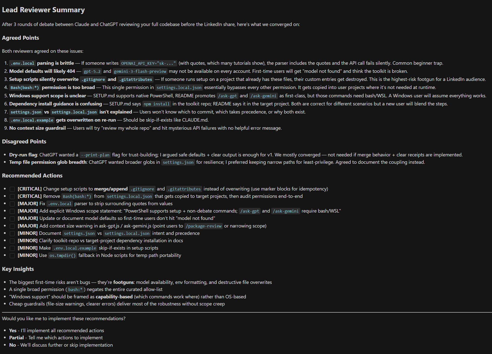
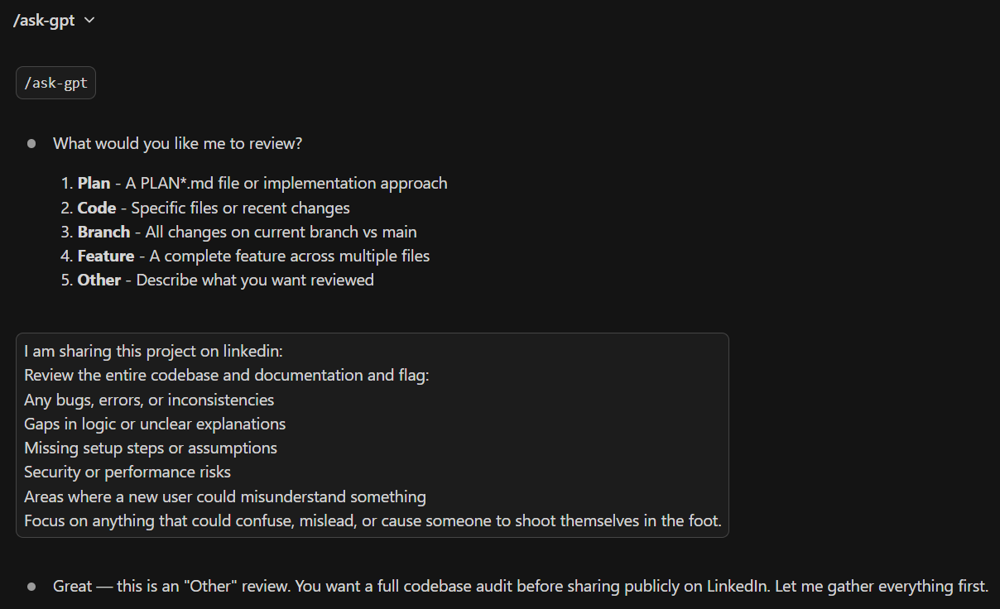

# LLM Peer Review

**AI peer review for your work. (Also: a structured workflow.)**



*A real `/ask-gpt` debate output: Claude and ChatGPT argue across up to three rounds and hand you a structured verdict (what they agreed on, where they disagreed, and a prioritized action list). You approve what gets implemented.*

This toolkit gives you slash commands for every step of a project: explore the problem, create a plan, build, review, then run a debate (up to 3 rounds) between Claude and ChatGPT (or Gemini). Works for product specs, research plans, competitive analysis, and code.

**Inspired by [Zevi Arnovitz's workflow on Lenny's Podcast](https://www.youtube.com/watch?v=1em64iUFt3U).** The key difference: Zevi manually copies feedback between models. This toolkit automates the entire debate loop with two commands (`/ask-gpt` and `/ask-gemini`).

This is the same consensus/divergence synthesis that [Perplexity's Model Council](https://www.perplexity.ai/hub/blog/introducing-model-council) produces and what [Karpathy's LLM Council](https://github.com/karpathy/llm-council) does for general Q&A, applied to a full project lifecycle with multi-round adversarial debate and an implementation workflow.

**New to slash commands?** A slash command is a shortcut you type into your AI editor's chat panel - it starts with `/` and tells the AI to run a specific workflow. The editors that support them are **Claude Code** (Anthropic's CLI plus editor panel for Claude) and **Cursor** (an AI-powered code editor built on VS Code). You'll need one of these installed; see [SETUP.md](SETUP.md) if you're starting from scratch.

---

## The Workflow


> **Solid arrows run on their own; dotted arrows you start yourself.** You type `/explore` and approve the plan. From there `/create-plan`, `/execute`, `/review`, and `/document` chain automatically. `/worktree` and the AI debates stay optional and always start with you.
>
> If the diagram doesn't render: you type `/explore` -> `/create-plan` writes the plan -> **you approve it** -> `/execute` -> `/review` -> `/document`. Optional and typed by you: `/worktree` before the run, `/ask-gpt` or `/ask-gemini` after the review.

You don't have to use every command every time. Following the order prevents the most common mistake: coding before you've thought it through.

**Two ways to take back control, and they do different things.** Say **"no chaining"** to stop the *handoff*: that run finishes its own stage and does not start the next one. Say **"report only"** to stop the *changing*: the run tells you what it found and edits nothing. They are deliberately separate, so you can have either without the other, and both last for one run only.

> **Want to see this in action?** Follow the 5-minute walkthrough in **[DEMO-SCRIPT.md](DEMO-SCRIPT.md)**.

> **Working on multiple things at once?** Use `/worktree` first to create an isolated copy, then open it in a new Cursor window and run `/explore` there.

---

## How key commands work

Six commands carry most of the workflow. Each has its own file in `.claude/commands/` with the full prompt; the summaries below are the "what is this, when do I use it" view.

### `/explore` - Understand before you build

Asks 3-4 focused questions about scope, success criteria, and constraints before any code is written. Has two modes: **scoping** (you have a concrete idea, pressure-test the scope) and **vision** (you're thinking big-picture, challenge the premise itself). It picks a mode by reading your input, then asks you to confirm. You can switch modes any time. Useful when you're not yet sure what you're actually building. When the conversation converges (no open questions left, and in vision mode a scope dial reading Hold or Reduce), it hands off to `/create-plan` on its own.

Full prompt: [`.claude/commands/explore.md`](.claude/commands/explore.md)

### `/create-plan` - Turn an idea into trackable steps

Produces a `plans/PLAN-*.md` file with status emojis (🟥 To Do, 🟨 In Progress, 🟩 Done) and a progress percentage at the top. Tags each step `[parallel]` or `[sequential]` so `/execute` knows what can run concurrently. Captures critical decisions and (for UI features) the design choices made during `/explore`. The plan becomes your single source of truth for the feature. It runs on its own after `/explore` converges, then **stops and waits for you** - approving the plan is the one human gate in the cycle, and nothing gets built until you say go.

Full prompt: [`.claude/commands/create-plan.md`](.claude/commands/create-plan.md)

### `/execute` - Build it, update the plan as you go

Walks through the plan step by step, updating status emojis and progress in real time. Spawns parallel agents for `[parallel]` steps, runs `[sequential]` steps in order. Small failures get at most 3 fix attempts per step. Stops on critical blockers (e.g. the plan assumed an API supports a feature it doesn't) instead of pushing through a broken plan. On a clean finish it hands off to `/review`; on a blocker it stops there and asks you.

Full prompt: [`.claude/commands/execute.md`](.claude/commands/execute.md)

### `/review` - Auto-detect what changed, run the right specialists, fix what they confirm

Looks at the diff and dispatches the relevant review skills (`/review-code`, `/review-security`, `/review-ux`, `/review-plan`, `/review-browser`, `/review-deps`, `/review-copy`, and others) in parallel. Before you read anything, the combined findings pass a three-tier audit: every finding ships with a receipt (a runnable check, like a grep or a test) that actually gets executed, survivors face a fresh skeptic whose default is to refute, and Block-severity findings must survive a three-skeptic vote. The report shows only the survivors in the 4-field structure (What / Why it matters / Example / Suggested fix), each with the check that proves it; everything the audit killed is listed one line each in an "Audited out" log, never fixed. Survivors are then fixed automatically, and each fix is re-verified (max 2 rounds) instead of assumed done - the run ends with a summary showing, for every fix, the check that proves it worked. Once the loop settles it hands off to `/document`, which finishes the cycle: docs updated, commits made, and (behind a secret-scanning tripwire) pushed. Your control points: you approved the plan before anything was built, the loop stops and asks whenever a decision genuinely needs a human (for example, edits to the toolkit's own prompt files), and two per-run phrases give you the wheel back - "report only" reports findings without changing anything, "no chaining" stops the handoff to the next stage.

Directly-typed `/review-*` runs are audited the same way before their reports - expect a few extra sub-agents (a skeptic per 7 findings, plus three voters for Block-severity findings) after the review itself, announced before they run. Loop rules: `.claude/skills/shared/hitl-loop.md`.

Full prompt: [`.claude/commands/review.md`](.claude/commands/review.md)

### `/ask-gpt` and `/ask-gemini` - Debate with another AI

Run a structured debate of up to 3 rounds between Claude and ChatGPT (or Gemini). They push back on each other, concede points, and produce a structured verdict: Agreed / Disagreed / Recommended Actions. Recommended Actions use the same 4-field structure as `/review` (What / Why it matters / Example / Suggested fix), so the output model is consistent across all peer-review surfaces. Each debate typically costs $0.01-$0.10 in API credits. Requires API keys from OpenAI and/or Google AI Studio. See [API-KEYS.md](API-KEYS.md) for setup.

Full prompts: [`.claude/commands/ask-gpt.md`](.claude/commands/ask-gpt.md) | [`.claude/commands/ask-gemini.md`](.claude/commands/ask-gemini.md)

### `/error-analysis` - find out what you keep correcting

Every time you step in during a cycle, correcting Claude or asking for something different, `/document` records it as one row in a ledger with a short note in your own words about what went wrong. `/error-analysis` reads those notes across every cycle, groups them into categories, counts them, and ranks them, so the thing you fix is the one that actually keeps happening rather than the one that happened most recently. It refuses to rank on fewer than ten rows, because a ranking built on two data points is the exact mistake it exists to prevent.

The data lives at `~/.claude/`, per machine, outside every repo. It is never published and never sent to another model. Turn it off for a repo with `touch .claude/.no-correction-log`.

Full prompt: [`.claude/skills/error-analysis/SKILL.md`](.claude/skills/error-analysis/SKILL.md)

### `/create-issue` - issues that don't bloat

Asks 2-3 clarifying questions first, then creates a short (10-15 line) issue via `gh issue create` on GitHub or `glab issue create` on GitLab. It picks the right one by reading your git remote, so there is nothing to configure. No implementation details; that's what `/explore` and `/create-plan` are for. Good for capturing bugs and ideas without context-switching out of your editor.

Full prompt: [`.claude/commands/create-issue.md`](.claude/commands/create-issue.md)

---

## All Commands

| Command | What it does |
|---|---|
| `/explore` | Understand the problem, ask clarifying questions before implementation |
| `/create-plan` | Write a step-by-step plan with status tracking |
| `/execute` | Build it, updating the plan as you go |
| `/review` | Run the right reviews automatically, audit the findings (receipts plus skeptics), fix the survivors, re-verify every fix |
| `/review-code` (skill) | Code review (single pass or 4 sub-agents) |
| `/review-security` (skill) | Application security review of a code change - injection, secrets, XSS, path traversal, SSRF, weak crypto (runs inside /review on every code change) |
| `/review-commands` (skill) | Review slash command prompts for quality, workflow, and consistency |
| `/review-plan` (skill) | Check if implementation matches a plan file in `plans/` |
| `/review-ux` (skill) | UX review from code/markup - usability, accessibility, user flows |
| `/review-browser` (skill) | QA a running web app via headless browser - screenshots, interactions, diagnostics |
| `/review-full` (skill) | Pre-release cross-domain check with Ready / Not ready recommendation |
| `/review-deps` (skill) | Dependency and supply chain security review |
| `/review-copy` (skill) | Copy clarity and reader orientation review |
| `/security-audit` (skill) | Deep on-demand whole-repo security audit - entry points, authorization, crypto, secret-history scan (run deliberately, not part of /review) |
| `/peer-review` | Evaluate feedback from other AI models |
| `/document` | Update your README and docs to match what was built |
| `/error-analysis` (skill) | Group the correction ledger's open codes into categories, count them, and rank what you keep correcting |
| `/create-issue` | Create an issue on GitHub or GitLab (asks you questions first) |
| `/pair-debug` | Focused debugging partner - investigate before fixing |
| `/ask-gpt` | Debate your work with ChatGPT (up to 3 rounds) |
| `/ask-gemini` | Debate your work with Gemini (up to 3 rounds) |
| `/package-review` | Bundle your work into one file for external review |
| `/learning-opportunity` (skill) | Learn a concept at 3 levels of depth |
| `/codebase-to-course` | Turn any codebase into a visual learning guide |
| `/playground` (skill) | Generate throwaway interactive HTML to compare options, drag-to-reorder, toggle variants, or tune sliders |
| `/audit-html` (skill) | Scan your project's own markdown for files that would benefit from an HTML view. Report-only |
| `/worktree` | Create an isolated parallel session in a new worktree |
| `/index` | (Re)generate the project's `CODEBASE_MAP.md` (semantic map of modules, conventions, gotchas) |

> `/ask-gpt` and `/ask-gemini` run the full debate loop automatically. `/peer-review` is for when you paste feedback from an external tool manually.

#### Which review command do I use?

| I need to... | Use |
|---|---|
| Check code for bugs, logic, and quality | `/review-code` |
| Security-check a code change (injection, secrets, XSS, ...) | `/review-security` (auto-runs inside `/review`) |
| Check dependencies/packages for known vulnerabilities (CVEs) | `/review-deps` |
| Deep whole-repo security audit (auth, secrets, crypto, history) | `/security-audit` |
| Review slash command prompts and workflows | `/review-commands` |
| Verify implementation matches a plan | `/review-plan` |
| Evaluate UX, accessibility, and user flows | `/review-ux` |
| QA a running web app via headless browser | `/review-browser` |
| Check if copy is clear to a fresh reader | `/review-copy` |
| Pre-release go/no-go check across all domains | `/review-full` |

---

## Already Have Your Own Workflow?

The toolkit now runs as a **loop** rather than a set of one-shot commands, and that is the change most likely to affect you if you arrive with your own commands, scripts, or way of working.

**What "a loop" means here.** The old behavior was report-first: a command found problems, showed you a list, and waited. The new behavior is that a command finds problems, checks them, fixes the ones that survive the check, verifies the fixes, and hands off to the next stage on its own. You type `/explore` and approve the plan. The rest runs. Two words stop it on any run: say **"report only"** and it reports without changing anything, or **"no chaining"** and it finishes that one stage without starting the next.

You do not have to give up what you already have. The loop is a pattern you can add to your own commands, and the rest of this section is how to do that safely, followed by what to check so your files survive an upgrade.

### Adding the loop to your own workflow

Automatic fixing is only safe because of what sits around it. If you take the "fix it automatically" half without these, you get the risk with none of the protection. In rough order of how much they matter:

| Add this | Why | Check your command |
|---|---|---|
| **An escape phrase** | Some runs you want to look before anything moves | Does your command honor "report only" by producing its report and changing nothing? If the phrase does nothing, you have no brake |
| **Proof attached to every finding** | A finding with no proof cannot be checked, so fixing it is guesswork | Does each finding carry a read-only command someone could run, plus a line saying what that output showed? |
| **A second opinion before the fix** | The thing that found a problem is the worst judge of whether it is real | Does anything with a fresh view check a finding before it gets fixed? Finder and judge must not be the same actor |
| **A different checker after the fix** | Models favor their own output and will not reliably catch their own mistakes | Does whatever wrote the fix also declare it verified? If yes, that verification is worth very little |
| **A retry limit and somewhere to fall back to** | Unbounded retrying is how an automatic command turns a small problem into a large one | Is there a number on the attempts, and a commit or checkpoint to revert to when they run out? |
| **A deletion guard** | A fix that restores something a person removed on purpose is a correct-looking regression | Before re-adding anything, does your command check whether a human deleted it deliberately? |

The short version: **auto-fixing is a privilege earned by verification.** Add the verification first and the automation second.

### Keeping your own files through an upgrade

Re-running setup is how you get toolkit updates, and it is also where custom work quietly disappears. These are worth checking once, before your next upgrade.

**Do not customize by editing a toolkit file.** Editing `.claude/commands/review.md` to add your own step works until the next upgrade copies the toolkit's version back over it. Put your customization in a file the toolkit does not ship.

**Do not use a name the installer reclaims.** These names were toolkit locations once, so setup backs them up and removes them without checking whose they are:

- In `.claude/commands/`: `review-code.md`, `review-ux.md`, `review-plan.md`, `review-commands.md`, `review-browser.md`, `review-full.md`, `learning-opportunity.md`, `dev-lead-gpt.md`, `dev-lead-gemini.md`
- In your project's top-level `scripts/`: `ask-gpt.js`, `ask-gemini.js`, `browse.js`, `dev-lead-gpt.js`, `dev-lead-gemini.js`
- At the root: `INDEX.md`

**Prefix your own files, or put them in a subfolder.** `.claude/commands/myteam/deploy.md` survives an upgrade byte for byte, and a prefix also protects you from names the toolkit adds in future versions.

**Check your root `package.json`.** Every setup run removes these five dependencies if it finds them: `openai`, `@google/generative-ai`, `@google/genai`, `playwright-core`, `@axe-core/playwright`. They belong to the toolkit and live in `.claude/scripts/` instead. It also removes `ask-gpt` and `ask-gemini` from your `scripts` block, but only when they still point at the retired `scripts/ask-gpt.js` path; a script of your own by that name pointing anywhere else is left alone. If your own code genuinely imports one of the five, re-add it after setup or restore it from the timestamped backup folder setup leaves behind.

**See all of this before it happens.** Run the installer with `--dry-run`. It changes nothing and prints what would happen:

```bash
bash /path/to/llm-peer-review/scripts/setup/setup.sh /path/to/your-project --dry-run
```

Your files listed under "Custom files detected" are safe. Anything under "Managed toolkit files that differ" is about to be replaced.

### If your command spawns subagents

**Give finder workers no ability to edit.** A worker that can both find problems and change files will apply its findings before anything has judged them, which removes the check that makes the loop safe.

**Send everything in the prompt.** A subagent starts blank. It does not inherit your conversation, and it does not discover skills on its own, so the criteria and the file excerpts have to be in the message you send it.

**Have a branch for the worker that fails.** Decide in advance what happens when one errors, times out, or returns something you cannot parse.

### A few things that will bite regardless

**Give temp files a per-run unique suffix.** Two tabs open on the same project will otherwise overwrite each other's working files.

**Never read a credentials file into the conversation.** Anything read becomes part of the transcript, and transcripts get written to temp files, sent to other AI models by the debate commands, and rendered into HTML. Copy such files with `cp`, which moves the bytes without putting them in context.

**Put permissions in `.claude/settings.local.json`.** That file is yours and survives upgrades. The committed `.claude/settings.json` does not.

**Do not overwrite a file a toolkit command opens by name:** `plans/PLAN-*.md`, `CODEBASE_MAP.md`, `LESSONS.md`, `LESSONS-detail.md`.

**One thing to expect rather than fix:** `/review` will not pick up your own reviewer automatically. Its specialist list is fixed, and subagents do not discover skills on their own. Type your command alongside it, or ask for it by name in the session.

---

## Requirements

This toolkit runs on **macOS, Linux, or WSL** (Windows Subsystem for Linux). Windows users: [install WSL](SETUP.md#step-4-optional-install-wsl-if-you-prefer-a-bash-workflow) first. Native Windows PowerShell also works for setup and all non-debate commands; only `/ask-gpt` and `/ask-gemini` require bash/WSL.

---

## What's New

**Latest release: v6.0.0** (August 2026). **This one changes behavior**, so read the first item before upgrading.

- **The loop no longer stops at a report.** A review used to hand you a list and wait for "fix it". It now fixes the findings that survived its own audit, re-verifies each fix with something other than whatever made it, and starts the next stage on its own. Two per-run phrases take control back, and they do different things: say **"report only"** and the run changes nothing, say **"no chaining"** and it finishes its stage without starting the next. Nothing was renamed or removed; what changed is what a command does once it starts.
- **Findings have to prove themselves before you see them.** Every finding now ships with a receipt (a read-only command, plus what its output must show), and the run executes it. What survives goes to a fresh skeptic told to refute it, and a Block-severity finding faces three. Expect shorter reports: the first live run killed four of seven findings. What was thrown out is listed rather than hidden.
- **Nothing gets pushed without a secret scan.** A tripwire reads every outgoing commit before any push the loop makes, looking for secrets, never-push files, and changes to shared settings. It reads commit by commit rather than the final diff, because a secret added and then removed leaves no trace at the end but still lands in history.
- **It works on GitLab now, not just GitHub.** Commands read your git remote and pick `gh` or `glab` from what they find. Worth knowing: the GitLab path was written from documentation and has never been executed, so treat it as untested. GitHub is unchanged.
- **HTML artifacts get a second viewport.** Plans, reviews, and cycle summaries still open in your local browser exactly as before, and are now also published to a private Claude-hosted page when your session can. Purely additive. Note that published pages embed the absolute paths of files on your machine, which is why the consent ask says so.

Upgrading from v5.2.0 or earlier? This release also carries v5.3.0 (the application-security review domain) and v5.4.0 (bounded, verifier-gated loops) - one re-run of setup picks up all of it.

Full history: the [version-by-version rollup in CHANGELOG.md](CHANGELOG.md#whats-new-since-v433) or the [GitHub releases page](https://github.com/mayankmankhand/llm-peer-review/releases).

---

## Add to a New Project

This isn't an app you install; it's a set of instructions that live in your project folder. Once they're there, type `/` in your editor and the commands show up.

### Recommended: Tell your AI agent to set it up

The fastest path is to let Claude Code, Cursor, or any AI agent with shell access install it for you. Open your project folder in Claude Code or Cursor, then paste the message below into the AI chat panel (the side panel where you chat with the assistant):

> "Set up the workflow from this repo in my project. Follow the instructions in https://github.com/mayankmankhand/llm-peer-review/blob/main/AGENT-SETUP.md"

[`AGENT-SETUP.md`](AGENT-SETUP.md) has step-by-step instructions written for AI agents. They will clone the toolkit, copy the right files into your project, install dependencies (if you want them), and prompt you for API keys.

### Manual Setup (run the script yourself)

Prefer to run the setup script yourself? Pick the script that matches your shell:

**Bash (WSL, macOS, Linux):**
```bash
bash /path/to/llm-peer-review/scripts/setup/setup.sh /path/to/your-project
```

**PowerShell (setup and non-debate commands - see [Requirements](#requirements)):**
```powershell
powershell -ExecutionPolicy Bypass -File C:\path\to\llm-peer-review\scripts\setup\setup.ps1 -Target "C:\path\to\your-project"
```

Or run from inside your project directory (no target needed):
```bash
cd /path/to/your-project
bash /path/to/llm-peer-review/scripts/setup/setup.sh
```

> **Note:** If you run the script from inside the toolkit repository without specifying a target, it shows an error to prevent accidentally copying files into the wrong place.

**Preview first (optional):** add `--dry-run` (bash) or `-DryRun` (PowerShell) to see exactly what an install or upgrade would do - version gap, migrations, files that would be overwritten, custom files that are left alone, and where backups go - without changing anything:

```bash
bash /path/to/llm-peer-review/scripts/setup/setup.sh /path/to/your-project --dry-run
```

Every real run prints the same pre-flight report before it touches anything.

**Local edits are guarded:** if you edited a toolkit-managed file, setup detects it (via a hash manifest at `.claude/.toolkit-manifest.json`) and asks before overwriting - in a terminal it prompts, in scripts and AI-agent runs it stops and lists the files. Add `--force` (bash) or `-Force` (PowerShell) after the target path to proceed without the prompt; every replaced file is still backed up first and listed at the end of the run.

**What setup does:**
- **Copies into your project:** commands, skills (including the prebuilt HTML shells), agent definitions (`.claude/agents/` - the worker roles `/review` and `/index` dispatch, carrying their model, effort, and tool settings), both rules files (`toolkit.md`, `html-outputs.md`), and all runtime and helper scripts (`ask-gpt.js`, `ask-gemini.js`, `browse.js`, `generate-index.js`, `render-html.js`, `session-init.js`, `pre-push-check.js`, `open-artifact.sh`), plus `VERSION` and `.env.local.example`. Detects and removes any legacy `INDEX.md`. `CODEBASE_MAP.md` (a semantic map of your project) is generated on your first `/explore` run, when Claude auto-invokes `/index`.
- **Preserves your work:** `CLAUDE.md`, `LESSONS.md` (plus its companion `LESSONS-detail.md`), and `settings.local.json` are skipped if they already exist - those are yours to customize. Custom files you add inside `.claude/commands/`, `.claude/skills/`, `.claude/agents/`, `.claude/scripts/`, or `.claude/rules/` are never modified or deleted (this guarantee is covered by the toolkit's installer test suite), and anything setup does overwrite is backed up to a timestamped `.toolkit-backup-*` folder first.
- **Always updates:** the managed rules files (`.claude/rules/toolkit.md`, `.claude/rules/html-outputs.md`).
- **Stays in the toolkit repo:** setup scripts (`setup.sh`, `setup.ps1`, `install-alias.*`) are never copied.

See [How It Works](#how-it-works-file-architecture) for details on which files are yours vs. managed by the toolkit.

### Reusable Command (for multiple projects)

Install a `setup-claude-toolkit` command you can run from anywhere:

**Bash (WSL, macOS, Linux):**
```bash
cd /path/to/llm-peer-review
bash scripts/setup/install-alias.sh
source ~/.bashrc  # or ~/.zshrc for zsh
```

**PowerShell (native Windows):**
```powershell
cd C:\path\to\llm-peer-review
powershell -ExecutionPolicy Bypass -File scripts\setup\install-alias.ps1
. $PROFILE  # Reload profile (or restart PowerShell)
```

> **Note:** If you don't have a PowerShell profile yet, the installer will create one for you automatically.

Then use it from anywhere:
```bash
setup-claude-toolkit /path/to/your-project
```

<a id="advanced-do-it-manually"></a>
<details>
<summary><strong>Advanced: Do It Manually</strong></summary>

Copy these into your project:

| What to copy | Where it goes |
|---|---|
| `.claude/commands/` (whole folder) | `your-project/.claude/commands/` |
| `.claude/skills/` (whole folder) | `your-project/.claude/skills/` |
| `.claude/agents/` (whole folder) | `your-project/.claude/agents/` |
| `.claude/rules/toolkit.md` | `your-project/.claude/rules/toolkit.md` |
| `.claude/rules/html-outputs.md` | `your-project/.claude/rules/html-outputs.md` |
| `.claude/settings.local.json` | `your-project/.claude/settings.local.json` |
| `.claude/scripts/` (`ask-gpt.js`, `ask-gemini.js`, `browse.js`, `generate-index.js`, `open-artifact.sh`, `pre-push-check.js`, `render-html.js`, `session-init.js`, `package.json`) | `your-project/.claude/scripts/` |
| `CLAUDE.md` | `your-project/CLAUDE.md` |
| `LESSONS.md` | `your-project/LESSONS.md` |
| `LESSONS-detail.md` | `your-project/LESSONS-detail.md` |
| `.env.local.example` | `your-project/.env.local.example` |
| `.gitignore` | `your-project/.gitignore` |
| `.gitattributes` | `your-project/.gitattributes` |
| `artifacts/README.md` | `your-project/artifacts/README.md` |

Then in your project folder:
```bash
# One install covers everything - it stays inside .claude/scripts/ so your
# project's own package.json is never touched.
npm install --prefix .claude/scripts

# For /ask-gpt and /ask-gemini, set up your API keys:
cp .env.local.example .env.local
# Open .env.local and paste your API keys

# For /review-browser, install the Chromium browser:
npx --prefix .claude/scripts playwright-core install chromium
# On Linux/WSL, also: sudo npx playwright-core install-deps chromium
```

> The debate commands and the browser command are optional. Skip the API keys if you don't want `/ask-gpt` and `/ask-gemini`. Skip the Chromium install if you don't want `/review-browser`. The core workflow commands work either way.

</details>

> **Never set up a dev environment before?** Follow the step-by-step guide in **[SETUP.md](SETUP.md)**. It covers Windows (WSL), Mac, Node.js, GitHub CLI, Cursor, and API keys - everything you need from scratch.

> **Not using Cursor?** The setup guide assumes Cursor, but the toolkit works with any editor that supports Claude Code. Copy the relevant setup page into any AI assistant and ask it to rewrite the steps for your editor.

---

## Update an Existing Project

Re-run the same setup command (or ask your AI agent to follow [`AGENT-SETUP.md`](AGENT-SETUP.md) again). It's safe to rerun: commands, scripts, and toolkit rules get updated; your `CLAUDE.md`, `LESSONS.md`, `LESSONS-detail.md`, and `settings.local.json` are never overwritten. Your `.gitignore` is merged (new toolkit entries added, custom entries preserved).

After updating, try `/audit-html` to see if any of your project's own markdown files would benefit from an HTML view. Toolkit outputs (plans, reviews, debates) already render HTML automatically; `/audit-html` is for your project's own long human-read pages.

Want optional features (`/ask-gpt`, `/ask-gemini`, `/review-browser`)? After re-running setup, run these in your project folder:

```bash
# Install the toolkit's runtime packages (one-time, stays in .claude/scripts/).
npm install --prefix .claude/scripts

# AI debate commands (/ask-gpt, /ask-gemini): set up API keys
cp .env.local.example .env.local
# Edit .env.local and paste your OPENAI_API_KEY and GEMINI_API_KEY

# Browser QA (/review-browser): install Chromium
npx --prefix .claude/scripts playwright-core install chromium
# On Linux/WSL only (apt-based; no --prefix needed):
sudo npx playwright-core install-deps chromium
```

**Check what's already installed:**
```bash
node -v                                                # Node.js
npm list --prefix .claude/scripts --depth=0            # toolkit runtime deps
npx --prefix .claude/scripts playwright-core --version # Chromium binary
```

### Checking Your Version

Open `.claude/rules/toolkit.md` in your project. The first comment near the top shows your installed version:

```
<!-- Toolkit version: X.Y | Managed by LLM Peer Review. ...
```

To update, re-run setup. The version stamp updates automatically. See [CHANGELOG.md](CHANGELOG.md) for what changed between versions.

**Coming from before the CLAUDE.md split?** If your `CLAUDE.md` has toolkit rules mixed in (workflow, permissions, slash commands table), those now live in `.claude/rules/toolkit.md`. After re-running setup, edit your `CLAUDE.md` to keep only project-specific info. See [CHANGELOG.md](CHANGELOG.md) for details.

---

## How `/ask-gpt` and `/ask-gemini` Work

`/ask-gpt` and `/ask-gemini` run an automated debate between Claude and another AI about your code or plan. You don't have to copy anything manually; the toolkit handles the whole loop. A debate runs up to 3 rounds - if both models fully agree after round 2, it ends early instead of running a third.

### Example

```
You: /ask-gpt

Claude: What would you like me to review?
        1. Plan    2. Code    3. Branch    4. Feature    5. Other

You: Review the auth middleware

Claude: [Gathers context → sends to ChatGPT → they debate up to 3 rounds]

        --- Summary ---
        Agreed: Add token expiry check, extract magic numbers

        Recommended Actions:
        - [ ] Add token expiry validation
        - [ ] Move 3600 to TOKEN_EXPIRY_SECONDS

        Want me to implement these?

You: Yes
```

Want a different perspective? Run `/ask-gemini` next.

> **API costs:** Each debate (up to 3 rounds) typically costs $0.01-$0.10 in API credits depending on context size. You'll need an OpenAI and/or Gemini API key with credits. See **[API-KEYS.md](API-KEYS.md)** for a step-by-step setup guide.

**Choosing what to review:**



---

## How It Works: File Architecture

When you set up the toolkit in a project, it creates several files. Here's how they fit together:

| File | Who owns it | What it does |
|---|---|---|
| `CLAUDE.md` | **You** | Your project-specific instructions (tech stack, preferences, team info). Never overwritten by setup. |
| `.claude/rules/toolkit.md` | **Toolkit** | Workflow rules, slash command docs, permissions. Always updated when you re-run setup. |
| `.claude/commands/*.md` | **Toolkit** (editable) | One file per slash command. You can customize these. |
| `.claude/skills/<name>/SKILL.md` | **Toolkit** (editable) | One folder per skill (review specialists, learning-opportunity). Auto-create slash commands and are agent-discoverable. `project-context` is agent-only (not user-invocable). |
| `.claude/skills/shared/*.md` | **Toolkit** (editable) | Shared reference files used by multiple review skills (`severity-anchors.md`, `output-template.md`, `finding-id-system.md`, `browse-api.md`). Editing one of these affects every skill that injects it. |
| `LESSONS.md` | **You** | Lesson index (one line per lesson). Read at the start of `/explore`, `/create-plan`, `/execute`, and `/pair-debug` so past lessons inform new work. Never overwritten. |
| `LESSONS-detail.md` | **You** | Full write-ups behind the index, opened on demand when a lesson is relevant. Never overwritten. |
| `.claude/scripts/generate-index.js` | **Toolkit** | Scans the project and emits a manifest used by `/index` to build `CODEBASE_MAP.md`. Always updated on setup. |
| `.claude/scripts/render-html.js` | **Toolkit** | Injects a JSON payload plus the shared `tokens.css` into a prebuilt shell (`.claude/skills/shared/shells/`) to render HTML artifacts (review, document, explore, debate, audit, plan, audit static view), naming each page from the payload's own title. Also keeps the artifact index (`--index-add` / `--index-url`) that records every artifact published to a hosted page. Always updated on setup. |
| `.claude/scripts/session-init.js` | **Toolkit** | Emits one JSON with codebase-map freshness, the lessons index, plan statuses, and worktree state, so `/explore`, `/create-plan`, `/pair-debug`, and `/execute` make one startup call instead of several reads. Always updated on setup. |
| `.claude/scripts/pre-push-check.js` | **Toolkit** | The pre-push tripwire: before any push it scans every outgoing commit for secrets, blocks never-push files (`.env`, `.env.local`, your local settings), and shows any shared-settings change. Silent when clean; a hit blocks the push and asks you. Always updated on setup. |
| `CODEBASE_MAP.md` | **Generated** | Auto-generated semantic map (modules, conventions, gotchas, navigation guide). Gitignored. Built by `/index`, refreshed by `/document`. |
| `plans/PLAN-*.md` | **Generated** | Plans produced by `/create-plan` and updated by `/execute`. Gitignored (local working docs). |

Setup also copies a few supporting files (`.gitignore`, `.gitattributes`, `settings.local.json`, `.env.local.example`). See [Advanced: Do It Manually](#advanced-do-it-manually) for the full list.

**Why is CLAUDE.md empty?** On purpose. It's a blank slate for your project-specific info. The toolkit rules live in `.claude/rules/toolkit.md` instead, so toolkit updates can reach you without overwriting your project notes.

**How does Claude find toolkit.md?** Claude Code automatically reads every file in `.claude/rules/` when it opens your project. No config needed; just having the file there is enough.

---

## Multi-Session Worktree Support

If you run multiple Claude Code sessions at the same time (in Cursor windows or via Remote Control), use Git worktrees so sessions don't conflict with each other.

**Starting a parallel session:** Type `/worktree` in the Claude Code panel. It creates an isolated worktree, installs dependencies, and copies your API keys. Open the path it gives you in a new Cursor window.

**What the toolkit does automatically:**
- `/worktree` creates the worktree, installs `npm` dependencies, and copies `.env.local`
- `/explore` and `/create-plan` detect worktree sessions and rename the branch to `worktree-<issue-number>-<short-label>` when an issue is referenced
- `/document` creates a PR from the worktree branch and offers to clean up the worktree folder when you're done
- The branch and PR stay alive even after the worktree folder is deleted; you can always re-create a worktree if fixes are needed

**What `/worktree` does:**
1. Checks you're not already in a worktree (and warns about uncommitted changes)
2. Creates a new worktree in `.claude/worktrees/worktree-N`
3. Runs `npm install` for both your host project (if a root `package.json` exists) and the toolkit (`.claude/scripts/package.json`), so debate and browser scripts work
4. Copies `.env.local` so API keys are available
5. Prints the path to open in a new Cursor window

**Key concept:** A worktree is just a folder. Deleting the folder does not delete the branch or PR. Think of it like closing a document window vs. deleting the file.

---

## Customization

- **CLAUDE.md** - Your project-specific instructions. Describe your project, tech stack, and preferences here. See [How It Works](#how-it-works-file-architecture) for details.
- **`.claude/rules/toolkit.md`** - Toolkit workflow rules (auto-updated on setup). Don't edit this; your changes will be overwritten.
- **Commands and skills** - Each file in `.claude/commands/` is independent. Skill folders in `.claude/skills/<name>/SKILL.md` work the same way. Want `/review-code` to check different things? Edit `.claude/skills/review-code/SKILL.md`. The 9 review skills are: `review-code`, `review-security`, `review-commands`, `review-plan`, `review-ux`, `review-browser`, `review-full`, `review-deps`, `review-copy`. There is also a standalone `security-audit` skill for a deep on-demand whole-repo security pass.
- **LESSONS.md** - Lesson index that Claude reads each session so past lessons feed back into new work; full write-ups live in **LESSONS-detail.md**. Both are yours to customize.

---

## Troubleshooting

- **Commands don't show up in Cursor** - Make sure `.claude/commands/` exists in your project root with `.md` files inside. The editor workspace root must be the folder that contains `.claude/`.
- **`/ask-gpt` or `/ask-gemini` fails** - Check that `npm install --prefix .claude/scripts` was run and `.env.local` has valid API keys.
- **`/ask-gpt` or `/ask-gemini` prints a "deprecated model" warning** - v4.5.0 auto-overrides outdated `GPT_MODEL` or `GEMINI_MODEL` env values with the current default. Edit `.env.local` to remove or update the stale value if you want to silence the warning. See [API-KEYS.md](API-KEYS.md#changing-the-model).
- **"setup.sh: command not found"** - Run the full command from the setup instructions, not just `setup.sh` on its own.
- **"target directory does not exist"** - Create the project folder first: `mkdir -p /path/to/project`
- **Script errors with `/bin/bash^M` or "bad interpreter"** - Line-ending issue. Your shell scripts have Windows-style line endings (CRLF) instead of Unix-style (LF). Easiest fix: delete the folder and clone fresh. Advanced fix: run `git add --renormalize . && git checkout -- .` in the repo.
- **Setup stops with "locally modified file(s) will be overwritten"** - You edited a toolkit-managed file, and setup will not silently replace it. Re-run with `--force` (bash) / `-Force` (PowerShell) added after the target path to proceed - your version is backed up to `.toolkit-backup-<timestamp>/` and listed at the end of the run so re-applying your changes is a checklist.
- **I customized a toolkit file and upgraded - where did it go?** - The setup script preserves your original at `.toolkit-backup-<timestamp>/` at the project root before overwriting. Copy it back if you want to keep your version. Safe to delete the backup directory when done.
- **Setup one-liner fails partway through** - Safe to rerun the command. Leftover `/tmp/tmp.*` folders are harmless and can be deleted. `.toolkit-backup-*/` directories from prior runs are also safe to delete once you have confirmed you do not need the originals.
- **Commands seem outdated or missing sections** - Delete any toolkit command files from `~/.claude/commands/`. Global copies override project commands and cause stale behavior. The setup script warns about this automatically.

---

## License

MIT - see [LICENSE](LICENSE)
