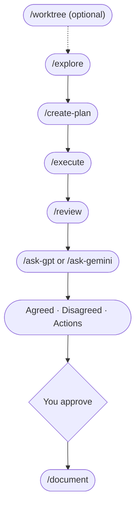

# LLM Peer Review

**AI peer review for your work. (Also: a structured workflow.)**


*A real `/ask-gpt` debate output: Claude and ChatGPT argue across three rounds and hand you a structured verdict (what they agreed on, where they disagreed, and a prioritized action list). You approve what gets implemented.*

This toolkit gives you slash commands for every step of a project: explore the problem, create a plan, build, review, then run a 3-round debate between Claude and ChatGPT (or Gemini). Works for product specs, research plans, competitive analysis, and code.

**Inspired by [Zevi Arnovitz's workflow on Lenny's Podcast](https://www.youtube.com/watch?v=1em64iUFt3U).** The key difference: Zevi manually copies feedback between models. This toolkit automates the entire debate loop with two commands (`/ask-gpt` and `/ask-gemini`).

This is the same consensus/divergence synthesis that [Perplexity's Model Council](https://www.perplexity.ai/hub/blog/introducing-model-council) produces and what [Karpathy's LLM Council](https://github.com/karpathy/llm-council) does for general Q&A, applied to a full project lifecycle with multi-round adversarial debate and an implementation workflow.

**New to slash commands?** A slash command is a shortcut you type into your AI editor's chat panel - it starts with `/` and tells the AI to run a specific workflow. The editors that support them are **Claude Code** (Anthropic's CLI plus editor panel for Claude) and **Cursor** (an AI-powered code editor built on VS Code). You'll need one of these installed; see [SETUP.md](SETUP.md) if you're starting from scratch.

---

## The Workflow



> If the diagram doesn't render: `/worktree` (optional) -> `/explore` -> `/create-plan` -> `/execute` -> `/review` -> `/ask-gpt` or `/ask-gemini` -> `/document`

You don't have to use every command every time. Following the order prevents the most common mistake: coding before you've thought it through.

> **Want to see this in action?** Follow the 5-minute walkthrough in **[DEMO-SCRIPT.md](DEMO-SCRIPT.md)**.

> **Working on multiple things at once?** Use `/worktree` first to create an isolated copy, then open it in a new Cursor window and run `/explore` there.

---

## How key commands work

Six commands carry most of the workflow. Each has its own file in `.claude/commands/` with the full prompt; the summaries below are the "what is this, when do I use it" view.

### `/explore` - Understand before you build

Asks 3-4 focused questions about scope, success criteria, and constraints before any code is written. Has two modes: **scoping** (you have a concrete idea, pressure-test the scope) and **vision** (you're thinking big-picture, challenge the premise itself). It picks a mode by reading your input, then asks you to confirm. You can switch modes any time. Useful when you're not yet sure what you're actually building.

Full prompt: [`.claude/commands/explore.md`](.claude/commands/explore.md)

### `/create-plan` - Turn an idea into trackable steps

Produces a `plans/PLAN-*.md` file with status emojis (🟥 To Do, 🟨 In Progress, 🟩 Done) and a progress percentage at the top. Tags each step `[parallel]` or `[sequential]` so `/execute` knows what can run concurrently. Captures critical decisions and (for UI features) the design choices made during `/explore`. The plan becomes your single source of truth for the feature.

Full prompt: [`.claude/commands/create-plan.md`](.claude/commands/create-plan.md)

### `/execute` - Build it, update the plan as you go

Walks through the plan step by step, updating status emojis and progress in real time. Spawns parallel agents for `[parallel]` steps, runs `[sequential]` steps in order. Stops on critical blockers (e.g. the plan assumed an API supports a feature it doesn't) instead of pushing through a broken plan.

Full prompt: [`.claude/commands/execute.md`](.claude/commands/execute.md)

### `/review` - Auto-detect what changed, run the right specialists

Looks at the diff and dispatches the relevant review skills (`/review-code`, `/review-ux`, `/review-plan`, `/review-browser`, `/review-deps`, `/review-copy`, and others) in parallel, then combines findings into a single report with the 4-field structure (What / Why it matters / Example / Suggested fix). Reports issues only; never edits your code until you say "fix it."

Full prompt: [`.claude/commands/review.md`](.claude/commands/review.md)

### `/ask-gpt` and `/ask-gemini` - Debate with another AI

Run a 3-round structured debate between Claude and ChatGPT (or Gemini). They push back on each other, concede points, and produce a structured verdict: Agreed / Disagreed / Recommended Actions. Recommended Actions use the same 4-field structure as `/review` (What / Why it matters / Example / Suggested fix), so the output model is consistent across all peer-review surfaces. Each debate typically costs $0.01-$0.10 in API credits. Requires API keys from OpenAI and/or Google AI Studio. See [API-KEYS.md](API-KEYS.md) for setup.

Full prompts: [`.claude/commands/ask-gpt.md`](.claude/commands/ask-gpt.md) | [`.claude/commands/ask-gemini.md`](.claude/commands/ask-gemini.md)

### `/create-issue` - GitHub issues that don't bloat

Asks 2-3 clarifying questions first, then creates a short (10-15 line) GitHub issue via `gh issue create`. No implementation details; that's what `/explore` and `/create-plan` are for. Good for capturing bugs and ideas without context-switching out of your editor.

Full prompt: [`.claude/commands/create-issue.md`](.claude/commands/create-issue.md)

---

## All Commands

| Command | What it does |
|---|---|
| `/explore` | Understand the problem, ask clarifying questions before implementation |
| `/create-plan` | Write a step-by-step plan with status tracking |
| `/execute` | Build it, updating the plan as you go |
| `/review` | Run the right reviews automatically, combine findings into one report |
| `/review-code` (skill) | Code review (single pass or 4 sub-agents) |
| `/review-commands` (skill) | Review slash command prompts for quality, workflow, and consistency |
| `/review-plan` (skill) | Check if implementation matches a plan file in `plans/` |
| `/review-ux` (skill) | UX review from code/markup - usability, accessibility, user flows |
| `/review-browser` (skill) | QA a running web app via headless browser - screenshots, interactions, diagnostics |
| `/review-full` (skill) | Pre-release cross-domain check with Ready / Not ready recommendation |
| `/review-deps` (skill) | Dependency and supply chain security review |
| `/review-copy` (skill) | Copy clarity and reader orientation review |
| `/peer-review` | Evaluate feedback from other AI models |
| `/document` | Update your README and docs to match what was built |
| `/create-issue` | Create a GitHub issue (asks you questions first) |
| `/pair-debug` | Focused debugging partner - investigate before fixing |
| `/ask-gpt` | Debate your work with ChatGPT (3 rounds) |
| `/ask-gemini` | Debate your work with Gemini (3 rounds) |
| `/package-review` | Bundle your work into one file for external review |
| `/learning-opportunity` (skill) | Learn a concept at 3 levels of depth |
| `/codebase-to-course` | Turn any codebase into a visual learning guide |
| `/audit-html` (skill) | Scan your project's own markdown for files that would benefit from an HTML view. Report-only |
| `/worktree` | Create an isolated parallel session in a new worktree |
| `/index` | (Re)generate the project's `CODEBASE_MAP.md` (semantic map of modules, conventions, gotchas) |

> `/ask-gpt` and `/ask-gemini` run the full debate loop automatically. `/peer-review` is for when you paste feedback from an external tool manually.

#### Which review command do I use?

| I need to... | Use |
|---|---|
| Check code for bugs, security, and quality | `/review-code` |
| Review slash command prompts and workflows | `/review-commands` |
| Verify implementation matches a plan | `/review-plan` |
| Evaluate UX, accessibility, and user flows | `/review-ux` |
| QA a running web app via headless browser | `/review-browser` |
| Check if copy is clear to a fresh reader | `/review-copy` |
| Pre-release go/no-go check across all domains | `/review-full` |

---

## Requirements

This toolkit runs on **macOS, Linux, or WSL** (Windows Subsystem for Linux). Windows users: [install WSL](SETUP.md#step-4-optional-install-wsl-if-you-prefer-a-bash-workflow) first.

---

## What's new since v4.3.3

Five releases land as one upgrade if you last installed v4.3.3:

- **v4.4.0 - Codebase map.** `/index` now produces `CODEBASE_MAP.md`, a semantic map (module purposes, conventions, gotchas) consumed by `/explore`, `/create-plan`, and `/pair-debug`. Replaces the flat-tree `INDEX.md` from v3.4.
- **v4.4.1 - Richer review explanations.** All `/review-*` skills now use a 4-field finding structure (What / Why it matters / Example / Suggested fix). Cosmetic-only findings are dropped instead of being bulked up.
- **v4.5.0 - Model default safety net.** `/ask-gpt` and `/ask-gemini` auto-override outdated `GPT_MODEL` or `GEMINI_MODEL` values in `.env.local`. Setting an old default (e.g. `gpt-5.4`) gets you the current default (`gpt-5.5`) with a one-line warning.
- **v4.5.1 - Documentation audit.** README repositioned for newcomers, "What's new" rollup added to CHANGELOG, deprecated-model warning explainer added to API-KEYS.md, broken anchors fixed. Doc-only release, no behavior change.
- **v4.6.0 - Debate hardening.** Two-PR cut. (#101) Empty-body detection in `/ask-gpt` and `/ask-gemini`: silent failures (token cap exhausted by reasoning, refusals, safety blocks) now throw a descriptive error naming both cause and fix. Default token cap raised from 4096 to 32000 (overridable via `GPT_MAX_TOKENS` / `GEMINI_MAX_TOKENS`). Each debate invocation gets a session ID embedded in its `/tmp` paths so two parallel Cursor or Claude Code tabs cannot clobber each other's transcripts. (#103) `/ask-gpt` and `/ask-gemini` final summaries now use the same 4-field finding structure as `/review` (What / Why it matters / Example / Suggested fix), with 🚫/⚠️/💡 emojis and R-IDs end-to-end. Disagreed Points use 🤔 instead of ⚠️ to avoid colliding with Warn severity.

See the [full upgrade summary in CHANGELOG.md](CHANGELOG.md#whats-new-since-v433), or re-run setup to pick up everything automatically.

---

## Add to a New Project

This isn't an app you install; it's a set of instructions that live in your project folder. Once they're there, type `/` in your editor and the commands show up.

### Recommended: Tell your AI agent to set it up

The fastest path is to let Claude Code, Cursor, or any AI agent with shell access install it for you. Open your project folder in Claude Code or Cursor, then paste the message below into the AI chat panel (the side panel where you chat with the assistant):

> "Set up the workflow from this repo in my project. Follow the instructions in https://github.com/mayankmankhand/llm-peer-review/blob/main/AGENT-SETUP.md"

[`AGENT-SETUP.md`](AGENT-SETUP.md) has step-by-step instructions written for AI agents. They will clone the toolkit, copy the right files into your project, install dependencies (if you want them), and prompt you for API keys.

### Manual Setup (run the script yourself)

Prefer to run the setup script yourself? Pick the script that matches your shell:

**Bash (WSL, macOS, Linux):**
```bash
bash /path/to/llm-peer-review/scripts/setup/setup.sh /path/to/your-project
```

**PowerShell (for setup only - see [Requirements](#requirements)):**
```powershell
powershell -ExecutionPolicy Bypass -File C:\path\to\llm-peer-review\scripts\setup\setup.ps1 -Target "C:\path\to\your-project"
```

Or run from inside your project directory (no target needed):
```bash
cd /path/to/your-project
bash /path/to/llm-peer-review/scripts/setup/setup.sh
```

> **Note:** If you run the script from inside the toolkit repository without specifying a target, it shows an error to prevent accidentally copying files into the wrong place.

**What setup does:**
- **Copies into your project:** commands, skills, runtime scripts (`ask-gpt.js`, `ask-gemini.js`, `browse.js`), the index generator, `VERSION`, and `.env.local.example`. Detects and removes any legacy `INDEX.md`. The new `CODEBASE_MAP.md` (a semantic map of your project) is generated on your first `/explore` run, when Claude auto-invokes `/index`.
- **Preserves your work:** `CLAUDE.md`, `LESSONS.md`, and `settings.local.json` are skipped if they already exist - those are yours to customize.
- **Always updates:** toolkit rules (`.claude/rules/toolkit.md`).
- **Stays in the toolkit repo:** setup scripts (`setup.sh`, `setup.ps1`, `install-alias.*`) are never copied.

See [How It Works](#how-it-works-file-architecture) for details on which files are yours vs. managed by the toolkit.

### Reusable Command (for multiple projects)

Install a `setup-claude-toolkit` command you can run from anywhere:

**Bash (WSL, macOS, Linux):**
```bash
cd /path/to/llm-peer-review
bash scripts/setup/install-alias.sh
source ~/.bashrc  # or ~/.zshrc for zsh
```

**PowerShell (native Windows):**
```powershell
cd C:\path\to\llm-peer-review
powershell -ExecutionPolicy Bypass -File scripts\setup\install-alias.ps1
. $PROFILE  # Reload profile (or restart PowerShell)
```

> **Note:** If you don't have a PowerShell profile yet, the installer will create one for you automatically.

Then use it from anywhere:
```bash
setup-claude-toolkit /path/to/your-project
```

<details>
<summary><strong>Advanced: Do It Manually</strong></summary>

Copy these into your project:

| What to copy | Where it goes |
|---|---|
| `.claude/commands/` (whole folder) | `your-project/.claude/commands/` |
| `.claude/skills/` (whole folder) | `your-project/.claude/skills/` |
| `.claude/rules/toolkit.md` | `your-project/.claude/rules/toolkit.md` |
| `.claude/settings.local.json` | `your-project/.claude/settings.local.json` |
| `.claude/scripts/` (`ask-gpt.js`, `ask-gemini.js`, `browse.js`, `generate-index.js`, `package.json`) | `your-project/.claude/scripts/` |
| `CLAUDE.md` | `your-project/CLAUDE.md` |
| `LESSONS.md` | `your-project/LESSONS.md` |
| `.env.local.example` | `your-project/.env.local.example` |
| `.gitignore` | `your-project/.gitignore` |
| `.gitattributes` | `your-project/.gitattributes` |

Then in your project folder:
```bash
# One install covers everything - it stays inside .claude/scripts/ so your
# project's own package.json is never touched.
npm install --prefix .claude/scripts

# For /ask-gpt and /ask-gemini, set up your API keys:
cp .env.local.example .env.local
# Open .env.local and paste your API keys

# For /review-browser, install the Chromium browser:
npx --prefix .claude/scripts playwright-core install chromium
# On Linux/WSL, also: sudo npx playwright-core install-deps chromium
```

> The debate commands and the browser command are optional. Skip the API keys if you don't want `/ask-gpt` and `/ask-gemini`. Skip the Chromium install if you don't want `/review-browser`. The core workflow commands work either way.

</details>

> **Never set up a dev environment before?** Follow the step-by-step guide in **[SETUP.md](SETUP.md)**. It covers Windows (WSL), Mac, Node.js, GitHub CLI, Cursor, and API keys - everything you need from scratch.

> **Not using Cursor?** The setup guide assumes Cursor, but the toolkit works with any editor that supports Claude Code. Copy the relevant setup page into any AI assistant and ask it to rewrite the steps for your editor.

---

## Update an Existing Project

Re-run the same setup command (or ask your AI agent to follow [`AGENT-SETUP.md`](AGENT-SETUP.md) again). It's safe to rerun: commands, scripts, and toolkit rules get updated; your `CLAUDE.md`, `LESSONS.md`, and `settings.local.json` are never overwritten. Your `.gitignore` is merged (new toolkit entries added, custom entries preserved).

After updating, try `/audit-html` to see if any of your project's own markdown files would benefit from an HTML view. Toolkit outputs (plans, reviews, debates) already render HTML automatically; `/audit-html` is for your project's own long human-read pages.

Want optional features (`/ask-gpt`, `/ask-gemini`, `/review-browser`)? After re-running setup, run these in your project folder:

```bash
# Install the toolkit's runtime packages (one-time, stays in .claude/scripts/).
npm install --prefix .claude/scripts

# AI debate commands (/ask-gpt, /ask-gemini): set up API keys
cp .env.local.example .env.local
# Edit .env.local and paste your OPENAI_API_KEY and GEMINI_API_KEY

# Browser QA (/review-browser): install Chromium
npx --prefix .claude/scripts playwright-core install chromium
# On Linux/WSL only (apt-based; no --prefix needed):
sudo npx playwright-core install-deps chromium
```

**Check what's already installed:**
```bash
node -v                                                # Node.js
npm list --prefix .claude/scripts --depth=0            # toolkit runtime deps
npx --prefix .claude/scripts playwright-core --version # Chromium binary
```

### Checking Your Version

Open `.claude/rules/toolkit.md` in your project. The first comment near the top shows your installed version:

```
<!-- Toolkit version: X.Y | Managed by LLM Peer Review. ...
```

To update, re-run setup. The version stamp updates automatically. See [CHANGELOG.md](CHANGELOG.md) for what changed between versions.

**Coming from before the CLAUDE.md split?** If your `CLAUDE.md` has toolkit rules mixed in (workflow, permissions, slash commands table), those now live in `.claude/rules/toolkit.md`. After re-running setup, edit your `CLAUDE.md` to keep only project-specific info. See [CHANGELOG.md](CHANGELOG.md) for details.

---

## How `/ask-gpt` and `/ask-gemini` Work

`/ask-gpt` and `/ask-gemini` run an automated debate between Claude and another AI about your code or plan. You don't have to copy anything manually; the toolkit handles the whole loop.

### Example

```
You: /ask-gpt

Claude: What would you like me to review?
        1. Plan    2. Code    3. Branch    4. Feature    5. Other

You: Review the auth middleware

Claude: [Gathers context → sends to ChatGPT → they debate 3 rounds]

        --- Summary ---
        Agreed: Add token expiry check, extract magic numbers

        Recommended Actions:
        - [ ] Add token expiry validation
        - [ ] Move 3600 to TOKEN_EXPIRY_SECONDS

        Want me to implement these?

You: Yes
```

Want a different perspective? Run `/ask-gemini` next.

> **API costs:** Each 3-round debate typically costs $0.01-$0.10 in API credits depending on context size. You'll need an OpenAI and/or Gemini API key with credits. See **[API-KEYS.md](API-KEYS.md)** for a step-by-step setup guide.

**Choosing what to review:**


---

## How It Works: File Architecture

When you set up the toolkit in a project, it creates several files. Here's how they fit together:

| File | Who owns it | What it does |
|---|---|---|
| `CLAUDE.md` | **You** | Your project-specific instructions (tech stack, preferences, team info). Never overwritten by setup. |
| `.claude/rules/toolkit.md` | **Toolkit** | Workflow rules, slash command docs, permissions. Always updated when you re-run setup. |
| `.claude/commands/*.md` | **Toolkit** (editable) | One file per slash command. You can customize these. |
| `.claude/skills/<name>/SKILL.md` | **Toolkit** (editable) | One folder per skill (review specialists, learning-opportunity). Auto-create slash commands and are agent-discoverable. `project-context` is agent-only (not user-invocable). |
| `.claude/skills/shared/*.md` | **Toolkit** (editable) | Shared reference files used by multiple review skills (`severity-anchors.md`, `output-template.md`, `finding-id-system.md`, `browse-api.md`). Editing one of these affects every skill that injects it. |
| `LESSONS.md` | **You** | Track what you learn across sessions. Never overwritten. |
| `.claude/scripts/generate-index.js` | **Toolkit** | Scans the project and emits a manifest used by `/index` to build `CODEBASE_MAP.md`. Always updated on setup. |
| `CODEBASE_MAP.md` | **Generated** | Auto-generated semantic map (modules, conventions, gotchas, navigation guide). Gitignored. Built by `/index`, refreshed by `/document`. |
| `plans/PLAN-*.md` | **Generated** | Plans produced by `/create-plan` and updated by `/execute`. Gitignored (local working docs). |

Setup also copies a few supporting files (`.gitignore`, `.gitattributes`, `settings.local.json`, `.env.local.example`). See [Advanced: Do It Manually](#advanced-do-it-manually) for the full list.

**Why is CLAUDE.md empty?** On purpose. It's a blank slate for your project-specific info. The toolkit rules live in `.claude/rules/toolkit.md` instead, so toolkit updates can reach you without overwriting your project notes.

**How does Claude find toolkit.md?** Claude Code automatically reads every file in `.claude/rules/` when it opens your project. No config needed; just having the file there is enough.

---

## Multi-Session Worktree Support

If you run multiple Claude Code sessions at the same time (in Cursor windows or via Remote Control), use Git worktrees so sessions don't conflict with each other.

**Starting a parallel session:** Type `/worktree` in the Claude Code panel. It creates an isolated worktree, installs dependencies, and copies your API keys. Open the path it gives you in a new Cursor window.

**What the toolkit does automatically:**
- `/worktree` creates the worktree, installs `npm` dependencies, and copies `.env.local`
- `/explore` and `/create-plan` detect worktree sessions and rename the branch to `worktree-<issue-number>-<short-label>` when an issue is referenced
- `/document` creates a PR from the worktree branch and offers to clean up the worktree folder when you're done
- The branch and PR stay alive even after the worktree folder is deleted; you can always re-create a worktree if fixes are needed

**What `/worktree` does:**
1. Checks you're not already in a worktree (and warns about uncommitted changes)
2. Creates a new worktree in `.claude/worktrees/worktree-N`
3. Runs `npm install` for both your host project (if a root `package.json` exists) and the toolkit (`.claude/scripts/package.json`), so debate and browser scripts work
4. Copies `.env.local` so API keys are available
5. Prints the path to open in a new Cursor window

**Key concept:** A worktree is just a folder. Deleting the folder does not delete the branch or PR. Think of it like closing a document window vs. deleting the file.

---

## Customization

- **CLAUDE.md** - Your project-specific instructions. Describe your project, tech stack, and preferences here. See [How It Works](#how-it-works-file-architecture) for details.
- **`.claude/rules/toolkit.md`** - Toolkit workflow rules (auto-updated on setup). Don't edit this; your changes will be overwritten.
- **Commands and skills** - Each file in `.claude/commands/` is independent. Skill folders in `.claude/skills/<name>/SKILL.md` work the same way. Want `/review-code` to check different things? Edit `.claude/skills/review-code/SKILL.md`. The 8 review skills are: `review-code`, `review-commands`, `review-plan`, `review-ux`, `review-browser`, `review-full`, `review-deps`, `review-copy`.
- **LESSONS.md** - Track what you learn across sessions. Yours to customize.

---

## Troubleshooting

- **Commands don't show up in Cursor** - Make sure `.claude/commands/` exists in your project root with `.md` files inside. The editor workspace root must be the folder that contains `.claude/`.
- **`/ask-gpt` or `/ask-gemini` fails** - Check that `npm install --prefix .claude/scripts` was run and `.env.local` has valid API keys.
- **`/ask-gpt` or `/ask-gemini` prints a "deprecated model" warning** - v4.5.0 auto-overrides outdated `GPT_MODEL` or `GEMINI_MODEL` env values with the current default. Edit `.env.local` to remove or update the stale value if you want to silence the warning. See [API-KEYS.md](API-KEYS.md#changing-the-model).
- **"setup.sh: command not found"** - Run the full command from the setup instructions, not just `setup.sh` on its own.
- **"target directory does not exist"** - Create the project folder first: `mkdir -p /path/to/project`
- **Script errors with `/bin/bash^M` or "bad interpreter"** - Line-ending issue. Your shell scripts have Windows-style line endings (CRLF) instead of Unix-style (LF). Easiest fix: delete the folder and clone fresh. Advanced fix: run `git add --renormalize . && git checkout -- .` in the repo.
- **I customized a toolkit file and upgraded - where did it go?** - The setup script preserves your original at `.toolkit-backup-<timestamp>/` at the project root before overwriting. Copy it back if you want to keep your version. Safe to delete the backup directory when done.
- **Setup one-liner fails partway through** - Safe to rerun the command. Leftover `/tmp/tmp.*` folders are harmless and can be deleted. `.toolkit-backup-*/` directories from prior runs are also safe to delete once you have confirmed you do not need the originals.
- **Commands seem outdated or missing sections** - Delete any toolkit command files from `~/.claude/commands/`. Global copies override project commands and cause stale behavior. The setup script warns about this automatically.

---

## License

MIT - see [LICENSE](LICENSE)
