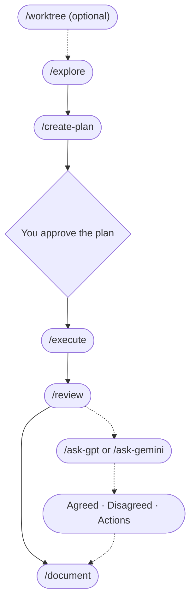

# LLM Peer Review

[](https://github.com/mayankmankhand/llm-peer-review/actions/workflows/test.yml) [](LICENSE) [](CHANGELOG.md)

**Multi-model AI debate for your entire project lifecycle. Plans, specs, research, and code. Free and open source.**

**For** product managers and small teams who build with AI and want the plan questioned before the code exists.

**Try it:** [install the plugin in two minutes](#try-it-in-two-minutes).

**Status:** the [latest release](https://github.com/mayankmankhand/llm-peer-review/releases) is the version in the badge above; every change is in [CHANGELOG.md](CHANGELOG.md).

**Inspired by** [Zevi Arnovitz's workflow on Lenny's Podcast](https://www.youtube.com/watch?v=1em64iUFt3U). He copies feedback between models by hand; this automates the loop.

## The problem

AI builds the thing in minutes. Nobody questions the plan first, so what gets built is the first idea, polished. A model reviewing its own plan mostly agrees with itself. The fix is a second model arguing with the first before you commit, inside a workflow that makes the argument happen at the right moment: after the plan, before the code.

## One debate, one changed plan


*February 2026, before this repository went public. Claude and ChatGPT reviewed the whole codebase across three rounds and agreed on nine problems. The `Bash(bash:*)` permission that bypassed every other rule and the brittle `.env.local` parser were fixed the same day (commit 8302a9f); the setup script stopped overwriting a project's `.gitignore` three weeks later (f38a124). They disagreed on two. ChatGPT wanted a dry-run flag for the installer; Claude argued safe defaults were enough. The flag shipped anyway, in June, in v5.2.0.*

<!-- GIF: docs/images/ask-gpt.gif, recorded by the owner -->

Every repository on [this profile](https://github.com/mayankmankhand) was built with it, in daily use since January 2026; the [releases page](https://github.com/mayankmankhand/llm-peer-review/releases) has the history.

## How it works


```mermaid
flowchart TD
    W(["/worktree (optional)"]) -.-> A(["/explore"])
    A --> B(["/create-plan"])
    B --> G{"You approve the plan"}
    G --> C(["/execute"])
    C --> D(["/review"])
    D --> H(["/document"])
    D -.-> E(["/ask-gpt or /ask-gemini"])
    E -.-> F(["Agreed · Disagreed · Actions"])
    F -.-> H
```

If the diagram does not render: you type `/explore`, `/create-plan` writes the plan, you approve it, then `/execute`, `/review` and `/document` run in turn. On the plugin the same commands carry the `tk:` prefix (`/tk:explore`).

- **You type `/tk:explore` and approve the plan.** Everything after that chains on its own: solid arrows run by themselves, dotted ones start with you.
- **A finding has to earn its fix.** Each review finding carries a runnable check and survives a skeptical audit before anything is changed; what survives is fixed, re-verified, and committed.
- **Two brakes, one run each.** "No chaining" stops the handoff to the next stage. "Report only" stops the editing.
- **The debates are yours to start.** `/tk:ask-gpt` or `/tk:ask-gemini` argues up to three rounds and hands you a verdict: agreed, disagreed, and a ranked list of actions you approve.

## Commands, ranked

| Command | What it does |
|---|---|
| `/tk:explore` | Understand the problem and pressure-test the idea before any code, in scoping or vision mode |
| `/tk:create-plan` | Write a step-by-step plan with status tracking, judged by a fresh-context critic before you see it |
| `/tk:execute` | Build it, commit each green step, and update the plan as it goes |
| `/tk:review` | Detect what changed, run the right specialists, audit their findings, fix the survivors, re-verify every fix |
| `/tk:document` | Update the docs, lessons, and changelog to match what was built, with a standing cycle summary |
| `/tk:ask-gpt` | Debate a plan or a change with ChatGPT, up to three rounds, verdict at the end |
| `/tk:ask-gemini` | The same debate with Gemini |

Every command, including the review skills, is described in [docs/COMMANDS.md](docs/COMMANDS.md); the full table is in the shipped manual, [toolkit-reference.md](.claude/skills/shared/toolkit-reference.md#slash-commands).

## Try it in two minutes

Inside Claude Code, from any folder:

```
/plugin marketplace add mayankmankhand/llm-peer-review
/plugin install tk@llm-peer-review
```

Restart Claude Code, open your project, and run `/tk:setup`. It writes a short rules file and a few seed files; nothing else lands in your project, and your own files are never overwritten.

Needs Claude Code 2.x with plugin support and Node.js 22 or newer. Cursor, Codex, and other editors use the copy-install in [docs/INSTALL.md](docs/INSTALL.md). API keys are needed only for the debates: [API-KEYS.md](API-KEYS.md).

## Docs

- [docs/INSTALL.md](docs/INSTALL.md): install, update, go back to an earlier release, the copy-install for other editors
- [docs/COMMANDS.md](docs/COMMANDS.md): how each command works, which review to use, how the debates run
- [docs/EXTENDING.md](docs/EXTENDING.md): keep your own workflow, extend a stage, the file architecture, parallel worktrees
- [docs/TROUBLESHOOTING.md](docs/TROUBLESHOOTING.md): what to do when something fails
- [DEMO-SCRIPT.md](DEMO-SCRIPT.md): a five-minute walkthrough
- [API-KEYS.md](API-KEYS.md): keys for the debates and the optional media generation
- [SETUP.md](SETUP.md): an editor from scratch, on Windows or Mac
- [AGENT-SETUP.md](AGENT-SETUP.md): for an AI agent doing the install
- [CONTRIBUTING.md](CONTRIBUTING.md) and [CHANGELOG.md](CHANGELOG.md)

## Prior art

[Perplexity's Model Council](https://www.perplexity.ai/hub/blog/introducing-model-council) produces the same consensus-and-divergence synthesis for one question, and [Karpathy's LLM Council](https://github.com/karpathy/llm-council) does it for general Q&A. This applies it to a full project lifecycle, with multi-round adversarial debate and an implementation workflow around it.

## License

MIT, see [LICENSE](LICENSE).

Built by [Mayank Mankhand](https://www.linkedin.com/in/mayankmankhand/), AI product manager. More at [github.com/mayankmankhand](https://github.com/mayankmankhand).
